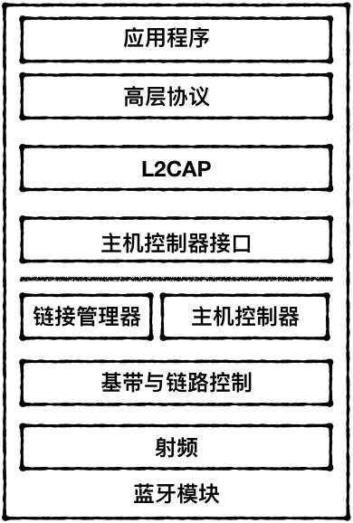
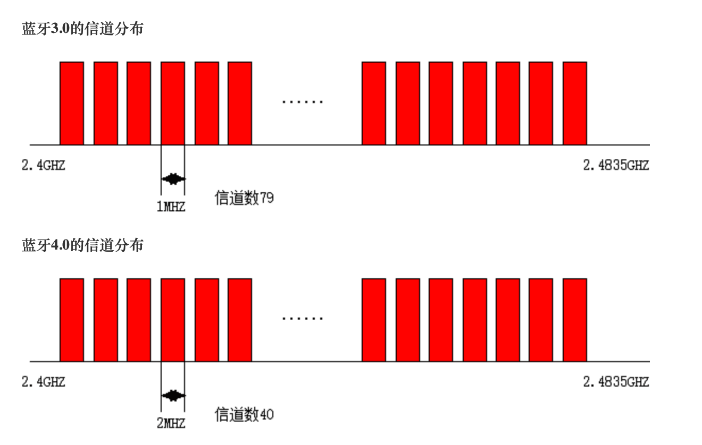
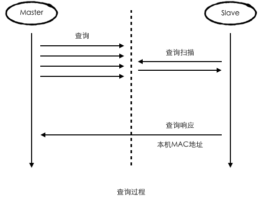
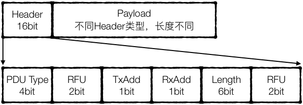
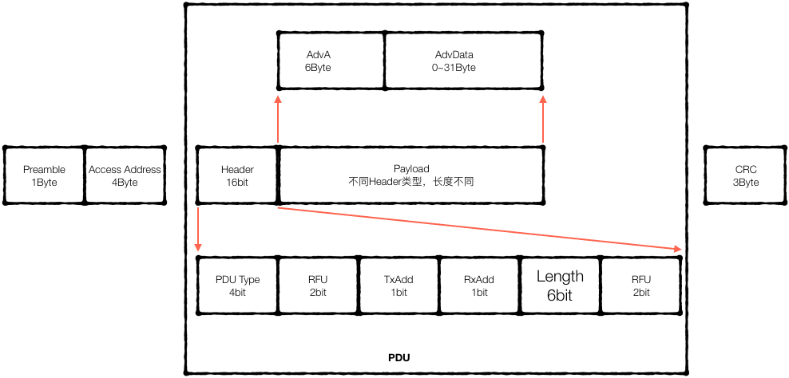
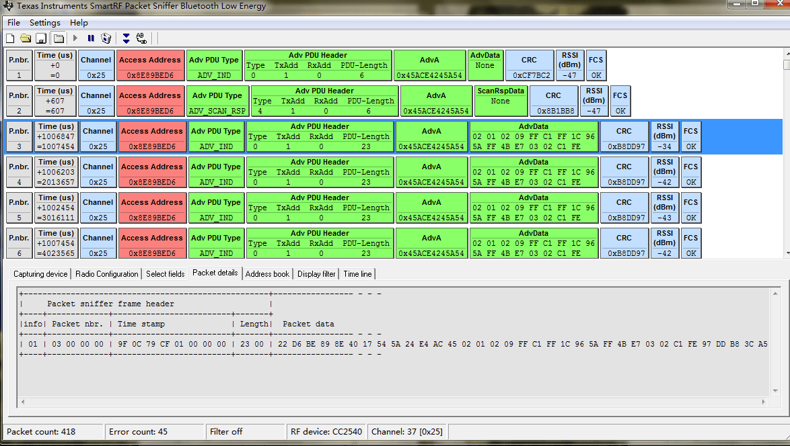
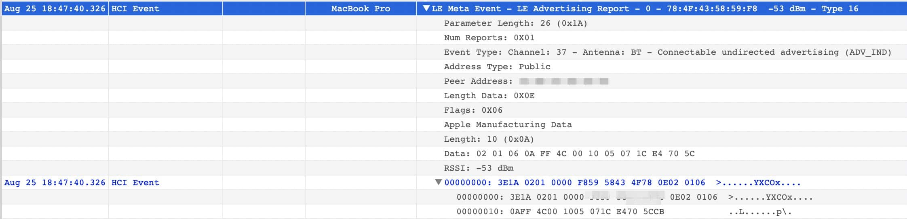

# 大纲

1. 前言
2. 历史
3. 结构
	1. 蓝牙规范
	2. 协议概览
	3. 层层解析
	4. 蓝牙应用框架
4. 单点解析
	1. 跳频
	2. BR/EDR 链路控制器状态
	3. BLE广播
	4. BLE 链路层状态
5. Apple Core  Bluetooth
	1. BR/EDR
	2. BLE
6. 工具
7. 参考资料

# 一、前言

接触`iOS Core Bluetooth`已经有一段时间了，但从应用层能接触到的蓝牙深度还是很有限的，大多只能停留在API级别，但对于蓝牙底层框架结构、信息传递、连接过程还是知之甚少。所以，最近抽空把蓝牙的底层相关的知道大概了解了一下，对相关知识点进行收集和整理。

由于底层很多东西涉及到电子信息工程、嵌入式的知识，而这些东西在大学毕业后就早早的还给老师了，并且日常的开发过程中也没有接触到这些内容的环境，所以很多内容也只是浅尝辄止了。

本文旨在描绘蓝牙的基本轮廓、基本概念，对其中我个人比较关心的点进行记录，并总结回顾BLE使用过程中遇到的一些问题。

因时间和水平有限，加上蓝牙硬件非常自己专项，文中的错误和不妥的地方，还请大家批评指正。

# 二、历史

蓝牙技术开始于爱立信在 1994 年创制的方案，该方案旨在研究移动电话和其他配件间进行低功耗、低成本无线通信连接的方法。发明者希望为设备间的无线通讯创造一组统一规则（标准化协议），以解决用户间互不兼容的移动电子设备的通信问题，用于替代 RS-232 串口通讯标准。随着研究的深入，爱立信发现短距离无线通信的应用前景无限广阔，并将这项将的无线通信技术命名为Bluetooth。

> 哈拉尔蓝牙王 Harald Blatand，丹麦国王（940—986年在位），哈拉尔征服了整个丹麦和挪威，并使丹麦人成为基督教徒。哈拉尔他被称为蓝牙王是因为Blatand翻译成英语是Bluetooth。  

1998 年 5 月 20 日，爱立信联合 IBM、英特尔、诺基亚及东芝公司 4 家著名厂商成立**特别兴趣小组**（Special Interest Group，SIG），即蓝牙技术联盟的前身，目标是开发一个成本低、效益高、可以在短距离范围内随意无线连接的蓝牙技术标准。

1999 年先后推出 0.8 版、0.9 版、1.0 Draft 版。完成了 SDP（Service Discovery Protocol）协定和 TCS（Telephony Control Specification）协定。

1999 年 7 月 26 日正式公布 1.0A 版，确定使用 2.4GHz 频段。和当时流行的红外线技术相比，蓝牙有着更高的传输速度，而且不需要像红外线那样进行接口对接口的连接，所有蓝牙设备基本上只要在有效通讯范围内使用，就可以进行随时连接。

1999 年下半年，微软、摩托罗拉、3Com、朗讯与蓝牙特别小组的五家公司共同发起成立了蓝牙技术推广组织，从而在全球范围内掀起了一股「蓝牙」热潮。

## 历史版本

1. 版本1.0——1999.7
2. 版本1.0b——1999.12
3. 版本1.1—— 2001.4
	
	传输率约在748~810kb/s，因是早期设计，容易受到同频率之间的类似通信产品干扰，影响通讯质量。这个初始版本支持Stereo音效的传输要求，但只能够以(单工)方式工作，加上带宽频率响应等指标不理想，并未算是最好的Stereo传输工具。

4. 版本1.2——2003

	同样是只有748~810kb/s的传输率，但增加了抗干扰**跳频功能** 。支持Stereo音效的传输要求，但只能够作(单工)方式工作，加上带宽频率响应还是不理想，也不能作为立体声(Stereo)传输工具。

	> 蓝牙所使用的频段和WLAN 802.11b/g冲突了；关于跳频后面会单独讲到

5. 版本2.0——2004

	Bluetooth2.0+EDR是1.2的改良提升版，传输率约在1.8M/s~2.1M/s，可以有(双工)的工作方式，即一边作语音通讯，同时亦可以传输档案/高质素图片，2.0版本当然也支持Stereo运作。随后蓝牙2.0版本的芯片，增加了Stereo译码芯片，则连A2DP(Advanced Audio Distribution Profile)也可以不需要了。

	> EDR主要是使用移相键控（PSK）技术来调变RF载波使每个符号的位元数增加2到3倍。BR则使用GFSK。更详细的内容可以了解一下`调制——调相、调频、调幅`相关的知识  

6. 版本2.1——2007

	为了改善蓝牙技术存在的问题，蓝牙SIG组织(Special Interest Group)推出了Bluetooth 2.1+EDR版本的蓝牙技术。**改善装置配对流程**：以往在连接过程中，需要利用个人识别码来确保连接的安全性，而改进过后的连接方式则是会自动使用数字密码来进行配对与连接。

7. 版本3.0+HS——2009

	2009年4月21日，蓝牙技术联盟(BluetoothSIG)正式颁布了新一代标准规范 ”Bluetooth Core Specification Version 3.0 High Speed” （蓝牙核心规范3.0版高速），蓝牙3.0的核心是“Generic Alternate MAC/PHY”(AMP)，这是一种全新的交替射频技术，允许蓝牙协议栈针对任一任务动态地选择正确射频。最初被期望用于新规范的技术包括802.11以及UMB，但是新规范中取消了UMB的应用。作为新版规范，蓝牙3.0的传输速度自然会更高。

	> 速度加强了很多，但从名字和实现上看，就是把WIKI的物理层和MAC层借来用了。但是一个切换，不共存的关系。

8. 蓝牙4.0——2010

	蓝牙4.0为蓝牙3.0的升级标准。蓝牙4.0最重要的特性是省电，极低的运行和待机功耗可以使一粒纽扣电池连续工作数年之久。此外，低成本和跨厂商互操作性，3毫秒低延迟、AES-128加密等诸多特色，可以用于计步器、心律监视器、智能仪表、传感器物联网等众多领域，大大扩展蓝牙技术的应用范围。

	蓝牙低功耗（BLE）不等同于蓝牙4.0，只是蓝牙4.0的一个分支，也被称为Bluetooth Smart。蓝牙4.0是蓝牙3.0+ HS(高速蓝牙)规范的补充，专门面向对成本和功耗都有较高要求的无线方案。虽然BLE和传统的蓝牙有一些重叠的地方，但是BLE来自Nokia的一个项目Wibree。2007年的时候达成协议，将Wibree收入蓝牙规范。

9. 蓝牙4.1——2013

	如果说蓝牙4.0主打的是省电特性的话，那么此次升级蓝牙4.1的关键词应当是IOT(全联网)，也就是把所有设备都联网的意思。为了实现这一点，对通讯功能的改进是蓝牙4.1最为重要的改进之一。

10. 蓝牙4.2标准——2014

	2014年12月4日，蓝牙4.2标准颁布，改善了数据传输速度和隐私保护程度，可直接通过IPv6和6LoWPAN接入互联网。在新的标准下蓝牙信号想要连接或者追踪用户设备必须经过用户许可，否则蓝牙信号将无法连接和追踪用户设备。

	速度方面变得更加快速，两部蓝牙设备之间的数据传输速度提高了2.5倍，因为蓝牙智能(Bluetooth Smart)数据包的容量提高，其可容纳的数据量相当于此前的10倍左右。

11. 蓝牙5.0协议——2016
	
	略

## 支持BLE的设备

* iOS5+ (iOS7+ preferred)
* Android 4.3+ (numerous bug fixes in 4.4+)
* Apple OS X 10.6+
* Windows 8 (**XP, Vista and 7 only support Bluetooth 2.1**)
* GNU/Linux Vanilla BlueZ 4.93+

# 三、结构

## 蓝牙规范

SIG发布的蓝牙规范包含两个部分：（1）核心协议(Core Protocol)；（2）应用框架(Profile)。协议规范定义了蓝牙各层的通信协议，其遵守OSI/RM。而且Profile则是指出如何使用这些协议来实现对应的产品。

> Protocol比做编程语言的基础语法，那Profile就可以理解为设计模式。是一种基于当前语法，针对某个问题的最佳实践。  

## 协议概览

下图是蓝牙协议的层次结构图。

				

## 各层功能

**射频**

功能作用：1. 处理空气中数据的收发；2. 载波产生；3. 信号调制；4. 功率控制；5. 信号强度；6. 数据收发。

> 这部分主要处理空中数据的收发。蓝牙射频所使用的频段，调制方式，跳频频率，发送功率等参数都在这一层。

**基带与链路控制**

功能作用：1. 跳频选择；2. 蓝牙编址；3. 链路类型；4. 信道编码；5. 收发规则；6. 音频规范；7. 安全设置

> 基带部分将上层传递来的数据进行信道编码并向下传递给射频部分；相反的，接收射频的解调过的数据，进行信道解码，向上层传递。 

**链路管理器**

功能作用：1. 链路质量管理；2. 链路控制；3. 链路安全；4. 数据分组；5. 设备功率管理

> 链路管理器运行在蓝牙模块中，蓝牙用户可以通过链路管理器对本地或者远端蓝牙设备的链路情况进行设置和控制。对于连接中的设备，可以根据RSSI，协商调节自己的设备功率。这里需要注意“协商”，因为根据协议，蓝牙设备在不寻求连接方的同意时，不应该单方面做出变更。

**主机控制器**

底层传输协议一般由蓝牙硬件模块实现，蓝牙模块内部嵌入式的微处理器为主机控制器。

**主机控制器接口**

蓝牙设备集成到数字设备中的两种方式：（1）单微控制器；（2）双微控制器。在双微控制器这种模式下需要一个HCI 来胶合**主机**和**主机控制器**。可以理解为一个适配器。它提供了一个控制基带与链接控制器、链路管理器、寄存器等硬件的统一接口。

**L2CAP**

逻辑链路控制与适配协议（Logical Link Control  and Adaptation Protocol）
功能作用：为高层协屏蔽底层传输协议的特性，适配上层和下层PDU大小的不同。

**串口仿真协议 (或称线缆替换协议RFCOMM)**

功能：模拟串口电缆的通信方式。为了兼容之前使用串口电缆通信的传统应用。

**蓝牙服务发现协议（SDP）**

功能：1. 服务搜索：搜索特定服务属性的服务；2. 服务浏览：搜索所有可用的服务；3. UUID:4位，32位 => 128位；4. 服务属性。

> SDP主要解决一个蓝牙设备如何发现其它设备，并知晓对应设备所能提供的服务。

**小结**

上面只是简单介绍了一下蓝牙的几个重要的协议。为了只是对蓝牙的协议结构有一个大概的认知。其中还有很多细节性和连贯性的知识：比如从上到下数据是怎么分组、发送的，每一层的PUD格式有什么不同；或者蓝牙工作状态是如何改变的；两个蓝牙设备之间是如何同步时钟周期的等等。但对于我这个端应用开发者来说，目前这些知识点了解就好了。就好比我们知道计算机OSI七层结构，对每一层的作用有所了解就足够了。如果有兴趣或者有需要可以继续深挖。

## 应用框架（Profile）

章节开始提到的蓝牙规范主要包括两个部分：（1）协议；（2）框架。上面已经对蓝牙的几个重要的协议进行简单介绍。下面来说一下框架。

不同的应用所使用的应用框架不同，框架内还可能嵌套其它基础框架。而**一个框架则是由多个协议组成，并描述了如何使用和配置各层协议**。例如要做一个蓝牙耳机产品，就去找一下对应产品的框架，然后遵守框架所描述的进行实现。这里拿两个核心的框架：GAP和GATT简单介绍一下。

**GAP**

GAP（蓝牙通用访问框架：Generic Access Profile）描述了两个蓝牙设备建立通信时必要的基本操作：发现设备，链路建立和配置，安全性设置。在GAP中还依赖SDAP（服务发现与应用框架），它描述了如何创建与应用那些使用SDP的应用程序。

GAP中有两个非常重要的角色：（1）**Central**；（2） **Peripheral** ；我习惯记做**主设备**和**从设备**。在App开发的场景下，主设备可以简单的理解就是我们的手机；从设备就是蓝牙外设。但很多场景其实要复杂一些，但类比一下就清楚了。

通过GAP，从设备可以让自己被外界发现。加入BLE后，从设备有两种方式可以让主设备知晓自己的存在：（1）通过BR/EDR的扫描查询（后面会讲到）（2）广播（后面会讲到）；但对于BLE来说，一般优先使用广播。

图：GAP蓝牙协议堆栈

**GATT**

GATT定义了主从设备之间数据传递的方式。使用过手机系统上层API的话，相信对这一层的结构已经很熟悉了。如下图为GATT框架。

图：基于GATT的结构	

在GATT中定义了两个重要的概念：**Services**、**Characteristics**。我习惯称做**服务**、**特征值**。GATT实现ATT（Attribute Protocol），使用一张表来管理这些Service。这张服务表的每一个Service都有一个的UUID，这个UUID谁都可以创建、发布，是没有集中管理组织的。UUID可以是16位还可以是128位的，16位的UUID可以通过换算变成128位的UUID。这个UUID就是我们在使用系统API进行服务扫描时所使用的Service UUID，iOS系统API支持使用16和128的UUID。从蓝牙规范上看，16位的UUID由Bluetooth SIG分配和发布。但如上面所说，并不强制约束。

> 个人感觉BLE框架ATT和BR/EDR的SDP很像。但不知道为啥要单独拆出来。  

GATT作用在连接建立后，并且Advertiser一旦转变成Peripheral，那广播就需要停止。（连接成功后，会停止广播 =。=结婚了就不要去浪了）。连接建立后，数据通信就是双向的了。

举个例子：某米公司出了一个手环用来记录心率，并为自己的这个功能添加了一个Service（16位UUID:0xFFFF）。蓝牙手环按一定的时间间隔不停的广播自己。而在这广播数据中就有他所支持的服务。某米App通过手机扫到了这个广播，然后发起连接请求。在连接后，就可以遍历这个设备所有的Service和Service下的Characteristics。然后在0xFFFF这个服务个有两个Characteristics：0xEEE0和0xEEE1。一个是写通道，一个是接收信息的通道。写通道就是Central向Peripheral发送数据的通道，读通道就是Peripheral向Central发送数据的通道。

## BR/EDR和BLE的结构差异

大多数蓝牙芯片一都只支持蓝牙低功耗(BLE)，所以我们称之为单模芯片；而同时支持传统蓝牙和蓝牙低功耗的IC一般是手机、平板和PC机上的芯片组，我们称之为双模芯片。当然，单颗支持传统蓝牙和蓝牙低功耗的芯片有些厂家也有，只是不太常见。下图是从网上摘的一个BR/EDR和BLE的结构图

# 四、单点解析

整个蓝牙涉及到知识非常多（数据层层传递、分组、发送接收；蓝牙状态控制；调制解调；信道编码；）。这里只对其中几个感兴趣的点进行解析一下。

## 跳频

1. 跳频频率

    跳频是扩频的一种实现方式。前面讲到蓝牙工作的频段为2.4~2.4835 GHz（有的国家不一样，但这是主流了），而这个工作频段和WLAN 802.11b/g 的工作频段相冲突了，为了避免相互干扰，蓝牙使用跳频技术来进行通信。
	
    在BR/EDR中，蓝牙有79个跳频频道，每个频道的带宽是1MHz。在频段前后分别加了3.51MHz和2MHz的保护带。但在BLE中一个信道占用2MHz的带宽，但总的频段并没有改变，所以BLE中只有40个信道。

    

	上图来源网络，对于蓝牙跳频频道还是很形象的。但图中的4.0信道分布应该是BLE信道分布。

2. 跳频序列分类

   1. BR/EDR

      * 寻呼跳频序列：在呼叫（Page）状态使用；该序列是根据待寻呼设备的地址和时钟而计算出的序列，在与外部设备建立连接时或者读取名称时进入该序列。
      * 寻呼应答序列：在呼叫应答（PageResponse）状态使用；周期性进入寻呼扫描状态，在特定的时间窗内监听到外部设备正在监听自己时进入该序列。
      * 查询序列：在查询（Inquiry）状态使用；特定的查询跳频序列可以被多个设备侦听到并给予回应，这样便可以发现多个设备。
      * 查询应答序列：在查询应答（InquiryResponse）状态使用；特定的查询跳频序列可以被多个设备侦听到并给予回应，这样便可以发现多个设备。查询过程获得的查询响应包含信息如下：
          * 从设备地址： 主设备利用它导出从设备的DAC和稍后在寻呼从设备的过程中用到的寻呼跳频序列。
          * 从设备的时钟值：它被用于估测从设备的相位，并以此来消除在后面的寻呼过程中的频率同步时延。
      * 信道跳频序列：在连接（Connection）状态使用。在已经建立连接的微微网中，主设备的时钟不变，从设备周期性地进行偏移以与主设备进行同步，相同的信道是指跳频序列是相同的。跳频序列便是由主设备的时钟和蓝牙地址共同衍生出来的。

    1. BLE
	
       * LE Piconet Channel用在处于连接状态的蓝牙设备之间的通信，和BR/EDR一样，采用跳频技术，但只会在40个频率channel中的37个上面跳频。
       * LE Advertisement Broadcast Channel用于在设备间进行无连接的广播通信，这些广播通信可用于蓝牙的设备的发现、连接（和BR/EDR类似）操作，也可用于无连接的数据传输。

## BR/EDR 链路控制器状态

1. 9个状态
   
    待机（Standby）、连接(Connect)、寻呼(Page)、寻呼扫描(Page Scan)、查询(Inquiry)、查询扫描(Inquiry Scan)、主设备响应(Master Response)、从设备响应(Slave Response)、查询响应(Inquiry Response)。

	> 关于这9种状态的流转，在蓝牙协议中有个复杂的图，有兴趣的可以去看下。但BLE的状态就相对简单很多。

2. BR/EDR查询过程

    

	先是主设备发出广播（大声呼喊：有人吗？）；然后从设备选择性的检查是不是有人在呼喊。得知有人在呼喊时，从设备可以选择不理采，也可以选择回响（Hi，我在这儿~！）。

3. BR/EDR寻呼过程

    

	在上面的查询响应中主设备得知从设备的地址后，就可以进一步的交流了。寻呼过程涉及到时钟同步、跳频序列同步等。

4. BR/EDR连接状态

	连接状态包含四种模式：激活模式、呼吸、保持、休眠。需要注意的是这是在连接状态下的四种模式。四种模式工作机制不同，耗电量也不相同。这里就不抄书了，有兴趣的可以自己查一下。

## BLE广播

从设备以固定的时间间隔向外发送广播数据。每次发送数据都需要占用信道，所以信息发送的时间需要小于发送间隔时间。虽然将广播频率调高可以提高发送蓝牙发现的速率和概率，但同时也带来了一定程度上的电量损耗。下面总结了广播的几个特性。

1. 广播包的发送是单向的，不需要任何连接
2. 广播包可以包含特定的数据
3. 广播包可以指向特定的设备
4. 广播包中可以声明自己是可以被连接的，或者不可连接的
5. 上面的跳频序列中有讲到BLE有3个广播信道。广播包会在这3个通道中分别发送。有的场景下广播通道被占用，那广播使用的信道就更少了。

*图：广播通道数据单元

上图为广播通道数据单元。相关字段的详细说明可以查看蓝牙规范。Header中定义的广播类型不同，所对应的长度也不一样。广播的PDU类型又分为广播和扫描。广播的PUD类型有4种：非定向可连接；定向可连接；非定向不可连接；可被扫描的非定向广播。这里以**ADV_IND**（非定向可连接）为例学习一下

下图是LinkLayer层的数据格式。

*图：LinkLayer数据格式

上图中的AdvData结构的格式如下：

*图：AdvData字段结构

来个实例看一看：

> 图片来源网络，这个工具之前在Window见人用过，但Mac OS，说实在的对软件开发者是神器，但对于硬件开发者来说就是花瓶。  

上面这张图大家对照结构看一下，就清楚了，没有什么复杂的逻辑，全是协议。对于其中的Access Address这个，根据蓝牙规范，在广播通道中是固定不变的，全一样。

> The Access Address for all advertising channel packets shall be 10001110100010011011111011010110b (0x8E89BED6).

上面大家看到的是Link Layer的封包，这个已经非常底层了，可以借助一类硬件工具获取到蓝牙广播，查看广播包信息。

最近跟随iOS13一起发布的还有一个蓝牙工具（后面再介绍）可以抓到HCI层的数据包。如下图所示（mac地址被打了码）。工具已经将原始数据解析出来了，我就不一一对应了。

*图：HCI数据包

*图：HCI Event Package格式

另外通过上面的广播数据可以看到，广播中是带有蓝牙设备MAC地址的，但Apple CoreBluetooth出于某种原因将这个信息隐藏起来了，导致现在想要确定搜索到的设备是指定设备，需要将标识放在广播的自定义字段中。但Android就可以直接拿到蓝牙设备的MAC地址。

还有就是HCI中的Address Type分为两种：（1）公有；（2）随机。公有的Address是需要花钱买的。

## BLE 链路层状态

`BLE`的`LinkLayer`和`BR/EDR`的`LinkManager`对应。在LinkLayer中有6种状态：待机（Standby）、广播(Advertiser )、扫描(Scanner)、连接(Initiator)、主设备(Master)、从设备(Slave)。相对于BR/EDR，BLE的状态流程简单很多

下图简单示意一下设备状态变更。

下图只是一个示意图，整个连接的过程中还有很多的数据通信，但对于上层应用开发者已经被完全屏蔽掉了。这里就不深究了。

# 五、Apple Core  Bluetooth

在iOS 13之前Core Bluetooth 只支持BLE，在iOS 13才加入BR_EDR的支持。但BR_EDR一直都有，只是系统没有暴露给开发者。所以，之前在播放音乐的时候，我所只能做到配置`AVAudioSessionCategoryOptionAllowBluetooth`让系统替我们处理了。

> 之前官方文档关于Core Bluetooth的描述：Communicate with Bluetooth 4.0 low-energy devices.  

关于**BLE**网上的例子一堆 ，大同小异的，这里就不重复了，有问题的可以去搜一下。**BR/EDR**这个还没有接触过，坑也没有踩过，放在后面接触过再单独写吧。

这里列几个在使用蓝牙遇到的问题（相对于Android来说，iOS的问题还是少很多的）：

1. 系统API并没有将Core Bluetooth的CBCentralManager设置成单例，所以在同一个应用中可以创建多个实例。但目前只尝试了扫描部分多实例，但连接之后的逻辑没有试过，也没有线上大批量数据验证。所以，只能确定，多个扫码实例是不会相互影响的。
2. 连接失败：对于有的手机存在找到设备但连接不上的问题，根据线上数据，iOS12比之前iOS10的系统的连接成功率掉了千分之几个点，连接用时也相比长了。XR的蓝牙性能比X要好点。
3. 连接成功，但找不到Charater。这个概率还挺大的。重试一下基本能解决。
4. iOS 13中添加了蓝牙权限的判断。虽然之前Core Bluetooth就暴露了这个接口，但一直没用。现在需要用起来了。
5. 蓝牙无权限和蓝牙没打开是在一个状态中表示的，那如果用户没有开蓝牙，也没有给权限，这个时候系统会返回什么呢？？？？？TODO

# 六、工具

1. Nordic: nRF Connect

	

	Nordic出的一个手机蓝牙App工具，还是很给力的。有兴趣的可以去他们的Github上看一下其它的库，相信可以收获很多，毕竟人家是专业做蓝牙芯片的。（后面应用更新了一版，应用图标都换了）

3. Apple: Core Bluetooth PacketLogger

	

	苹果自家出的，可以抓到一些日志信息。按WWDC2019上介绍的，用起来感觉还是不错的。Apple官网有下载，操作很简单。

4. 自研
   
	上面介绍的两个工具都是基于通用协议来做的。但真实开发过程中，通常是需要结合自身业务场景的。所以建议开发一个结合自身通信协议的工具App来协助自己日常开发、测试。

# 七、参考资料：

1. https://mp.weixin.qq.com/s/j4qPJu-lve4x9W4vci59SQ
2. http://www.wowotech.net/bluetooth/bt_overview.html
3. http://www.wowotech.net/bluetooth/bt_protocol_arch.html
4. http://www.wowotech.net/bluetooth/ble_stack_overview.html
5. http://www.wowotech.net/bluetooth/ble_broadcast.html
6. https://learn.adafruit.com/introduction-to-bluetooth-low-energy
7. 《蓝牙核心技术及应用》
8. https://www.bluetooth.com/zh-cn/specifications/assigned-numbers/generic-access-profile/
9. https://www.bluetooth.com/specifications/gatt/services/
10. https://www.bluetooth.com/specifications/gatt/characteristics/

