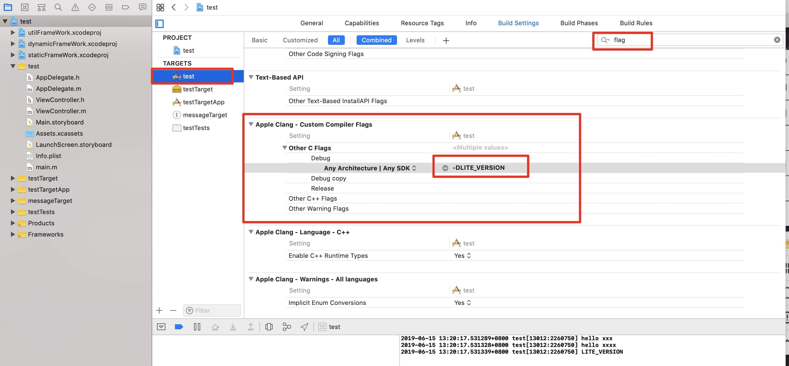

## 引言

和xcode打交道的少不了和这几个东西打交道。虽然，平时脑子里对它们有大概有一个认知。但，要说得一清二楚就有点难了。所以，学习了下前人的经验总结，在这里把这几个概念理一下，转换成自己的东西。顺便练习一下打字。 =。=

## **WorkSpace** 

我习惯翻译成工作空间。一个WorkSpace可以包含多个Project。包含的Project可以是相互关联的，也可以是互不相干的。下面是一个WorkSpace的示例，我在这个工作空间下创建了多个独立的Project。每个Project都是一个单独的iOS App。这样在做Demo项目管理的时候很方便。不用来回打开多个Xcode。

```
<?xml version="1.0" encoding="UTF-8"?>
<Workspace
   version = "1.0">
   <FileRef
      location = "group:ObjectiveCAppCollection.xcodeproj">
   </FileRef>
   <FileRef
      location = "group:Pods/Pods.xcodeproj">
   </FileRef>
   <FileRef
      location = "group:../../../../../.cocoapods/repos/FJCommon/FJCommonProject/FJCommonProject.xcodeproj">
   </FileRef>
   <FileRef
      location = "group:FJProjects/Habit/Habit.xcodeproj">
   </FileRef>
   <FileRef
      location = "group:FJProjects/FJMapDemo/FJMapDemo.xcodeproj">
   </FileRef>
   <FileRef
      location = "group:FJProjects/ReactiveObjeCDemo/ReactiveObjeCDemo.xcodeproj">
   </FileRef>
   <FileRef
      location = "group:FJProjects/FJQRScan/FJQRScan.xcodeproj">
   </FileRef>
</Workspace>

```

当然，平时接触工作空间最多的还是Cocoapods生成的项目，类似下面这样的。

```
<?xml version="1.0" encoding="UTF-8"?>
<Workspace
   version = "1.0">
   <FileRef
      location = "group:LeanPod.xcodeproj">
   </FileRef>
   <FileRef
      location = "group:Pods/Pods.xcodeproj">
   </FileRef>
</Workspace>

```

cocoapods把所有的依赖放在一个单独的Project中。然后每一个依赖又是一个单独的target。最后统一集成到主项目中。

## **Project** 

Project可以理解了一个独立的项目，可以是一个App项目，还可以是一个静态库。一个Project内部其实就默认会有一个workspace，但还不清楚是用来干啥的。我向一个Project中添加多个Project，主Project中workspace并没有改变内容。主Project对从Project的引用记录在project.pbxproj中。在project.pbxproj里会记录依赖的位置。

关于Project，最重要的就是project.pbxproj这个文件了。很多的文件冲突也就是这个文件了。我们项目里添加文件，删除文件都会对这个文件进行修改。关于这个文件的介绍，Google百度一大把，我很久之前（还是个小白的时候写过：[pbxproj.md](../iOSer/pbxproj.md)）

*备注：* 

1. 当我创建一个frameWork的时候，public中头文件无法对private中的头文件进行引用
2. 无论把文件放在public还是private中，都可以被主工程引用到，但放在project中就不行了。

## **Target、Scheme** 

在Xcode中创建一个project的时候，会自动创建一个target、一个scheme，2个configuration。但是创建完后，我们可以任意添加target, scheme, configuration。例如，在创建Today widget, imessage, 测试项目的时候，我们都会创建对应的Target。最典型的还是cocoapods的用法。

一个target有一个对应的scheme。scheme中可以设置对应的configuration。

下图演示了在configuration中添加一个flag一个类似Debug和Relead的用法。




```objective-c
#if LITE_VERSION
    NSLog(@"LITE_VERSION");
#else
    NSLog(@"FULL_VERSION");
#endif
```

## 总结

以上，只是皮毛。整个xcode项目的配置是非常复杂，如果不是由于特别的原因，个人觉得没有必要全部弄清楚。平时也用得也不多。我现在也只是知道个大概，所想达到的效果也只是说遇到的问题的时候知道从哪里入手，不至于说一脸蒙逼。后续会把遇到的一些问题收集起来。

---

## 参考文献

[Apple官方文档](https://developer.apple.com/library/archive/featuredarticles/XcodeConcepts/Concept-Workspace.html#//apple_ref/doc/uid/TP40009328-CH7-SW1)

[Let's Talk About project.pbxproj](http://yulingtianxia.com/blog/2016/09/28/Let-s-Talk-About-project-pbxproj/)