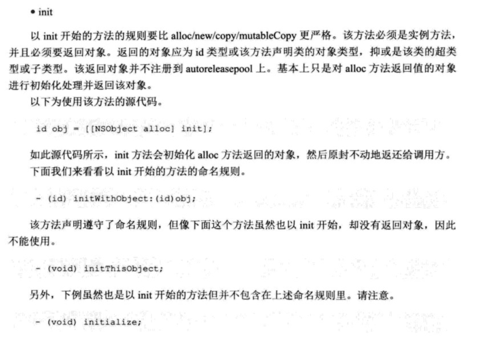
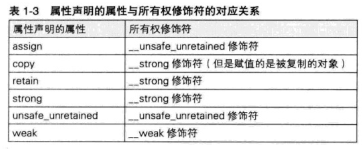

# @property

## 分类

    1. 线程安全：atomic / nonatomic   ::默认为atomic::
    2. 读写控制：readonly / readwrite  ::默认为readwrite::
    3. 内存管理：retain / assign / strong / weak / unsafe_unretained / copy 
    4. 读写方法：setter / getter 用于set和get方法重命名

## 读写方法

很简单，平时也不常用，这里看个例子就过了

```Objective-C
//注意setter方法有带参数的，所以需要加冒号
@property (nonatomic, assign, getter=isOk, setter=setOk:) BOOL isOk;

-(BOOL)isOk{
    return YES;
}

-(void)setOk:(BOOL)isOk{
    
}			
```

## 读写控制
不多说，给个例子，这样的话`identify`对外就是只读的，而对内就是可读写的。这种用法还是很常用的。

```Objective-C
//.h文件
@interface RootViewController : UIViewController
@property (nonatomic, strong, readonly) NSString *identify;
@end

//.m文件
@interface RootViewController ()
@property (nonatomic, strong, readwrite) NSString *identify;
@end
```

- - - -

## 内存管理

### 关于默认值

关于内存管理的默认值，我试了一下并不像网上说的那个是`assign`。
实验代码：

```Objective-C
@interface RootViewController ()
@property () UIView * testView;
@property () NSArray *array;
@property () TestBlock block;
@property () NSInteger intValue;
@end

@implementation RootViewController

- (void)viewDidLoad {
    [super viewDidLoad];
    self.testView = [[UIView alloc]initWithFrame:CGRectMake(1, 1, 1, 1)];
    self.array = @[@"1"];
    self.intValue = 2;
    self.block = ^{
		  //xcode在这里报了循环引用的警告
        NSLog(@"%@",self.testView);
        NSLog(@"%ld",self.intValue);
    };
   
}

- (IBAction)action:(id)sender {
    NSLog(@"%@",self.testView);
    NSLog(@"%ld",self.intValue);
    NSLog(@"%@",self.array);
    NSLog(@"%@",self.block);
}
```
结果：
```
2017-11-15 21:58:52.509771+0800 ObjAppLab[24887:3174674] <UIView: 0x7fc5d2708210; frame = (1 1; 1 1); layer = <CALayer: 0x6000002306c0>>
2017-11-15 21:58:52.510376+0800 ObjAppLab[24887:3174674] 2
2017-11-15 21:58:52.510615+0800 ObjAppLab[24887:3174674] (
    1
)
2017-11-15 21:58:52.510960+0800 ObjAppLab[24887:3174674] <__NSMallocBlock__: 0x600000441dd0>
```
由结果可以看出，内存管理并没有统一的默认值。我个人猜测对于`id和对象`类型，默认使用`strong`。

- - - -

### 作用于对象的内存操作

* 创建并持有( `alloc/new/copy/mutableCopy`)
这里需要强调一件事，OC编译器对创建方法的命名是有规则要求的。对于以`alloc/new/copy/mutableCopy`开头的方法，需要返回调用方应该持有的对象。另外对于以**init**开头的方法有额外的要求：

所以，平时在命名实现方法时，对于非初始化方法要回避**init**。至于无视规则会怎么样？ （2333，我也想知道，可能会有性能上的损耗吧）

* 持有(`retain`)
* 释放(`release`)
* 回收(`dealloc`)

> 在MRC下对象的内存管理操作很麻烦，不过要是写过C++项目的，理解起来会容易很多。C++ Primer中有专门讲到**智能指针**的实现细节  

- - - -

### 所有权修饰符

ARC为了实现自动引用计数，而引入**所有权修饰符**：

**__unsafe_unretained __strong __weak __autoreleasing**

* MRC下的NSAutoReleasePool被`@autoreleasepool{}`替换掉了。
* 当需要在C语言结构体中使用对象型变量，需要将对象型变量显示转换成`void*`或者添加`__unsafe_unretained`。因为编译器无法管理C语言结构体生命同期。通过添加`__unsafe_unretained`来使得编译器无视变量的生存周期。

**retain / assign / strong / weak / unsafe_unretained / copy**


#### retain/strong
找了很久，但还是觉得这两个东西是一样的。内存中的对象不增加，只是引用计数+1，类似于浅拷贝。从现在来看，retain已经很少见到了。

#### copy
了解了retain/strong之后，这个就很好理解了，它会在内存中新开辟一个空间，将原来的值复制进去。使变量指向新的内存地址。所以原来变量的引用计数不会+1。一般对于string类型的属性使用copy会比较多，主要是NSString strong在某些场景下会有问题。

#### weak
weak对象被干掉时会将weak引用设为nil，而对nil发送消息都不会导致崩溃
否则weak引用为野指针，会出现问题。TODO:BEAR:H weak的实现好像是维护了一个列表，后面再补充。

#### assign / __unsafe_unretained
如表格中所写的，这两个是一样的。表示编译器不管理变更的生存周期。`assign`用在基本数据类型。__unsafe_unretained用在对象类型上。

- - - -

### Core Foundation  <==> Foundation
```Objective-C
CFBridgingRetain(id  _Nullable X>)
CFBridgingRelease(CFTypeRef  _Nullable X)
```
CFBridgingRetain接收一个Foundation对象，返回一个`Core Foundation`对象。
CFBridgingRelease接收一个 `Core Foundation`，而返回一个`Foundation`对象

CFBridgingRetain表示对对象进行了Core Foundation retain操作。而Core Foundation中没有自动内存管理，所以需要在自己手动调用`CFRelease(<#CFTypeRef cf#>)`。

CFBridgingRelease表示对象在Core Foundation 中已经进行了release操作。而在Foundation中，对象的生命周期由编译器接管，所以不用再自己释放了。

- - - -


## 线程安全
[[关于atomic 和 nonatomic 有什么区别]]