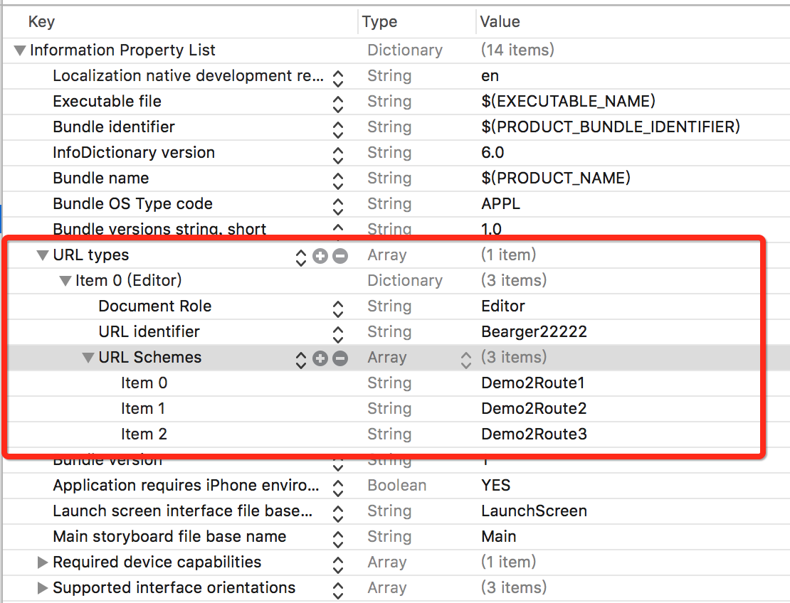
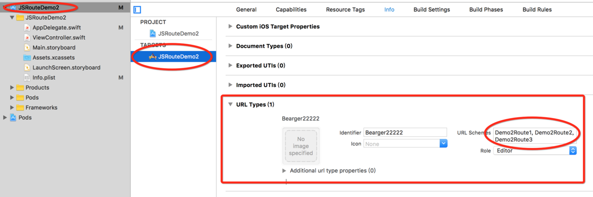
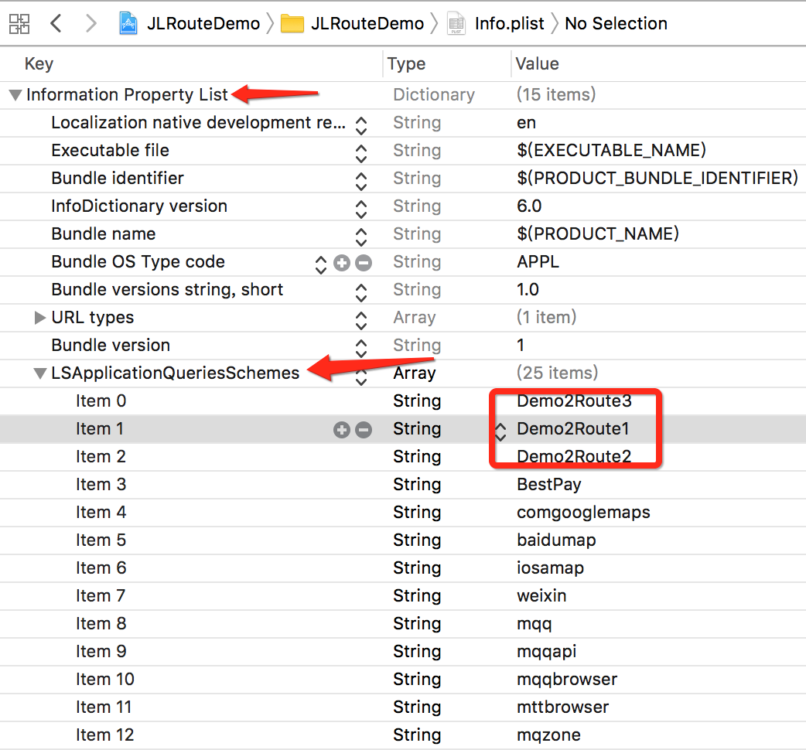

# OpenUrl
#程序员/iOS/其它

[iOS-使用URL Schemes，进行应用之间跳转](http://www.jianshu.com/p/e14df92cb207)
[iOS - JLRoutes路由跳转](http://www.jianshu.com/p/5d621b433c51)
[官方文档](https://developer.apple.com/library/content/documentation/iPhone/Conceptual/iPhoneOSProgrammingGuide/Inter-AppCommunication/Inter-AppCommunication.html)
[**JLRoutes** Git 项目地址](https://github.com/joeldev/JLRoutes)

主要参考上面文章。看完上述几篇文章基本就可以扛抢上战场了。

下面只做下简单的笔记：
####1. 添加scheme
scheme的添加是配置出来的，xcode中有两个地方可以进行配置，见下面两张图：








####2. 添加白名单
应用A跳转到应用B需要将B的open url的scheme添加到白名单中（ios9+，参看[iOS-使用URL Schemes，进行应用之间跳转](http://www.jianshu.com/p/e14df92cb207)），白名单也是配置，如下图





####3. 发起跳转

```
        if UIApplication.shared.canOpenURL(URL(string: "Demo2Route2://post/edit/123?debug=true&foo=bar")!)
        {
            let options = [UIApplicationOpenURLOptionUniversalLinksOnly : false]
            UIApplication.shared.open(URL(string: "Demo2Route2://post/edit/123?debug=true&foo=bar")!, options: options, completionHandler: { (complete) in
                print("finished")
            })
        }

```

#### 4.接收跳转
```
    func application(_ application: UIApplication, didFinishLaunchingWithOptions launchOptions: [UIApplicationLaunchOptionsKey: Any]?) -> Bool {
        // Override point for customization after application launch.
        let routes = JLRoutes.global()
        routes.addRoute("/:object/:action/:primaryKey") { (params: [String : Any]) -> Bool in
            
            print(String(describing: params))
            return true
        }
        
        JLRoutes.init(forScheme: "Demo2Route1").addRoute("/:object/:action/:primaryKey") { (params:[String : Any]) -> Bool in
            print("---Demo2Route1---\n")
            print(String(describing: params))
            return true
        }
        JLRoutes.init(forScheme: "Demo2Route2").addRoute("/:object/:action/:primaryKey") { (params:[String : Any]) -> Bool in
            print("---Demo2Route2---\n")
            print(String(describing: params))
            return true
        }
        JLRoutes.init(forScheme: "Demo2Route3").addRoute("/:object/:action/:primaryKey") { (params:[String : Any]) -> Bool in
            print("---Demo2Route3---\n")
            print(String(describing: params))
            return true
        }
        return true
    }
    
    func application(_ app: UIApplication, open url: URL, options: [UIApplicationOpenURLOptionsKey : Any] = [:]) -> Bool {
        return JLRoutes.routeURL(url)
    }
    
    func application(_ application: UIApplication, open url: URL, sourceApplication: String?, annotation: Any) -> Bool {
        return JLRoutes.routeURL(url)
    }
```

到这里，JLRoutes实现跳转的这条路已经走通了。如何应用就看自己项目需要了。细节什么的，通过实践以及查看文档就可以了。
