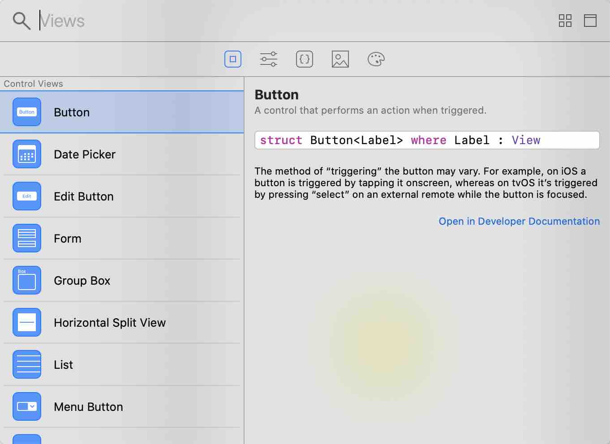
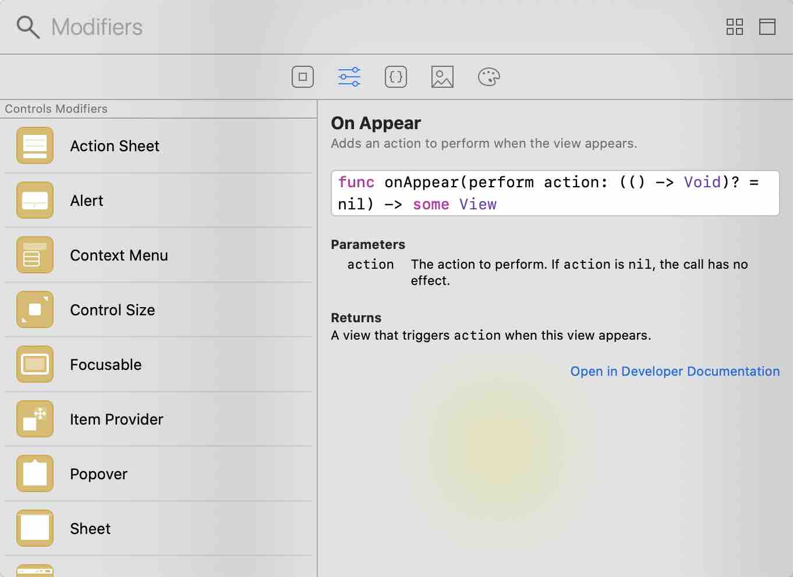

# 初体验

第一天，从官网下载的demo存在问题，性能和使用上都谈不上稳定。
自己新建了一个试验工程，相对要好一点，但是说实在的，还远远不够，一堆bug。
主要的问题还是集中在inspector上。不过单纯的写代码和预览的话，是没有太大的问题的。
button在设置frame的时候要接在init之后，不然，背景色无法铺满整个view
swift的代码提示很有问题，明明可以调用的，但代码提示里没有。  


第一天的尝鲜的总体感觉就是Apple终于放弃没用sb了。DSL在web领域已经很久了，它的UI开发非常高效，之前在开发RN的时候就感受到了。


# 一、N久后再次尝试

2019-12-01 22:57:46 周日

感觉上修复了不少bug，性能上也改进了不少。Let's coding~!

## 1. body里面可以放哪些View

感觉XCode library中可以拖的视图组件都可以放进去的样子，我来试一下(正好熟悉一下一些不常用的组件):



**LayoutViews**
1. [GeometryReader](https://swiftui-lab.com/geometryreader-to-the-rescue/)
   新加的View，看了人这家的介绍，感觉牛B哄哄的。
2. HStack
3. VStack
4. Spacer
5. ZStack

**Paints**
1. LinearGradient
2. AngularGradient
3. RadialGradient

**Shape**
1. Capsule
2. Circle
3. Ellipse
4. Rectangle
5. RoundedRectangle

**View**
1. Divider
2. Image
3. Color
4. Group
5. Path
6. VSplitView:OSX
7. HSplitView:OSX
8. Toggle
9. TextField
10. Text
11. TabView
12. Stepper
13. Slider
14. SecureField
15. Section
16. ScrollView
17. Picker
18. PasteButton:OSX
19. NavigationView
20. NavigationLink
21. MenuButton:OSX
22. List
23. GroupBox:OSX
24. Form
25. EditButton
26. DatePicker

## 2. Modifiers Library

这里定义了很多行为，也可以直接拖拽给对应的View实例。




## 3. 小结

以上只是尝试了一下拖拽视图。但有的View使用相对简单，但有的使用起来就相对复杂。在试用的时候还遇到Binding对象。没有细看，猜测是和Redux类似的绑定机制。

下一步就需要一个一个的看看每一个View的基本用法了。当然之其中还会遇到很多问题和概念，可以先一一记录下来

# 二、一些View的基本用法

## 1. View:Protocol

SwiftUI中View是一个协议，协议的实现类需要有一个body属性，而这个body又必须是View类型的。View本身就只要求这一个属性。但SwiftUI中给View添加了一堆的extension。大概看了一下，感觉就是把所有视图组件实现的方法全抽象到View protocol的extension中，整个是一个平铺的结构。从代码上看这些extension全放在一个文件里了，虽然好像是已经被分类了，但还是从文档上看比较清楚一些：https://developer.apple.com/documentation/swiftui/view

## 2. Text

呃，虽然很基础的一个组件，但可能在新的模式下有不同的使用方式或者特点呢。

这东西就是之前lable。使用起来和之前差不多，不过，接口名基本大变样。虽然也很形象，但估计需要适应一断时间了。

这种函数式的编程方式还是很方便的，说实在的的确的OC的语法写起来方便一些。不过在这种语法糖的时候需要注意函数的返回，因为可以调用的方法，并一定返回的就是实例本身，也可能是父类。比例`foregroundColor`这个方法它返回的就是View类型。如果把这个方法放在前面调用，那语法糖就进行不出去了。所以，在写的时候当然是优先子类方法调用，再父类方法调用。

```swift
Text("hello world\nhello\nbearger.xiongwei\n")
    .fontWeight(Font.Weight.black)
    .baselineOffset(12)
    .tracking(2)
    .underline()
    .strikethrough()
    .italic()
    .font(Font.system(size: 15))
    .lineLimit(3)
    .foregroundColor(Color.yellow)
    .background(Color.gray)
                
```

从提供的接口上看，的确比之前要强大了。把一些attributeStr中的设置也直接用接口的形式暴露出来了。但，问题来了：Text目前还不支持attributedString。T_T 但，下面的这篇文章用另一种方式实现了 http://www.gfrigerio.com/nsattributedstring-in-swiftui/。从实现原理上看和`UIViewRepresentable`这个协议强相关的，这个协议是继承了`View`协议，但加了`where Self.Body == Never`。😂swift加了好多关键字啊，头痛。

> Structures and enumerations marked as @frozen can’t add, remove or reorder stored properties and cases [SE-0260](https://github.com/apple/swift-evolution/blob/master/proposals/0260-library-evolution.md).

## 3. TextField


# 问题收集

1. Binding类型
2. 使用UIViewRepresentable自定义View