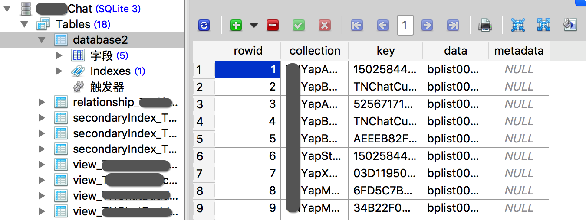

# YapDataBase
#程序员/iOS/数据

[Home · yapstudios/YapDatabase Wiki · GitHub](https://github.com/yapstudios/YapDatabase/wiki)

# 定义
对sqlite3的封装、{collection_key_value}数据库、集成了一些extensions

# 表结构
以下是一个示例，可以看到所有数据在一张表中，数据按序列化存储



# 一个简单的例子：
1. 创建数据库
2. 获取连接
3. 通过连接进行读写

```obj-c
// Create and/or Open the database file
YapDatabase *database = [[YapDatabase alloc] initWithPath:databasePath];

// Get a connection to the database (can have multiple for concurrency)
YapDatabaseConnection *connection = [database newConnection];

// Add an object
[connection readWriteWithBlock:^(YapDatabaseReadWriteTransaction *transaction) {
	[transaction setObject:@"Hello" forKey:@"World" inCollection:@"example1"];
}];

// Read it back
[connection readWithBlock:^(YapDatabaseReadTransaction *transaction) {
	NSLog(@"%@ World", [transaction objectForKey:@"World" inCollection:@"example1"]);
}];
```

# 一些知识点
## transaction：
对数据进行的一次元子操作

## 并发：
	1. 可以在一个数据库上建立多个连接
	2. 每个连接都是线程安全的
	3. 多个read-only transaction可以同时进行，相互之间不会阻塞
	4. 可以有多个read-only transaction和一个read-only transaction同时进行，相互不会阻塞
	5. 一个数据库一次只能有一个read-write transaction，对数据库进行写操作是在一个串行队列上进行的
	6. 一个connection一次只能进行一个transaction，每个connection上的transaction在一个串行队列中

## extension：
	* YapDatabaseView    
	* secondary index
	* 全文检索
	* and so on

## 缓存：
从数据库读到数据反序列化后会进行缓存，并且没有使用NSCache，而是采用自己构建的缓存结构。可以在设置一个数据库的缓存大小，还可以设置一个连接的缓存大小。
NSCache很多内容对开发者都是透明的，开发者对内存的管理只能是建议。iOS系统中很多地方都是这样的。eg: setNeedsLayout

## 序列化：
Yapdatabase将对象序列化以后按key+collection存放在数据库中。这样对数据进行升级会很方便
可以使用默认的NSCoding序列化，还可以使用Yapdatabase提供的其它序列化，还可以实现自定义的序列化

## collection：
如果只按照key/value存储，当数据量过大的时候，会产生key冲突。
YD通过{key,collection}来唯一确认数据库中的一条记录
```obj-c
/**
 * Fast enumeration over all keys in the given collection.
 *
 * This uses a "SELECT key FROM database WHERE collection = ?" operation,
 * and then steps over the results invoking the given block handler.
**/
- (void)enumerateKeysInCollection:(NSString *)collection
                       usingBlock:(void (^)(NSString *key, BOOL *stop))block;

```


## Metadata：
metadata是一个可选项，可以被设置在nil。
有啥用呢？数据库中的一个字段，看个人需求了。官方文档中提到了一些使用示例[Metadata · yapstudios/YapDatabase Wiki · GitHub](https://github.com/yapstudios/YapDatabase/wiki/Metadata)
`setObject:forKey:inCollection:withMetadata:`

## 最优性能指南：
* 当在同一个connection上进行了读写两种操作。其中循环写入时，会阻塞连接。所以此处需要注意的是connection执行transaction时，是按串行执行的

* connection创建很容易，但创建connection是有代价的。并且connection可以有自己的缓存。那connection对象一多，缓存也就跟着上来了。

* 每一个connection在执行transaction时是串行的，要实现并发，需要建立多个connection。

* 一个数据库同一时间只能执行一个写操作。所以，当有多个connection都进行readwrite_transaction时，这些操作是串行的。

* 如果通过只读事务就可以处理的任务，不要使用读写事务进行处理

* 最佳实践：
	* 在UI线程中单独使用一个connection，
	* 并且只在UI线程中使用这一连接
	* 这一连接只进行读事务
	* 使用独立的connection进行读写操作
	
* 由于connection在执行transaction时是串行的，所以不要在同一个connection的transaction中进行嵌套。

## LongLivedReadTransactions：
Transaction在执行block时会对数据库进行快照，block执行结束，快照就结束了。
LongLivedReadTransactions会给connection上的快照添加标签。多次调用LongLivedReadTransactions会更新标签，并同时更新快照。添加标签后，在此connection上的读取操作，都会使用新的快照。
关于快照的更新需要注册广播，当收到数据库更新广播时，去更新快照。
::当在一个connection上开启LongLivedReadTransactions时，不要在此connection上进行写操作。::
不需要手动结束LongLivedReadTransactions，但需要手动注销广播监听。

## YapDatabaseModifiedNotification
当数据库退出的时候，YD就会发出这样一个通知。收到通知后，调用 `NSArray *notifications = [database beginLongLivedReadTransaction];`就可以得到快照在两次标签之间的所有变更。

## Extensions：Views
Views就是执行`select xxx from table where xxx group by xxx order by xxx`后得到结果。然后将这个结果单独放在一张表中，并打上标签。对主表的更新会自动同步到这张表上。
当标签不变时，重启App不会多次创建View；

## Mappings
> The YapDatabaseViewMappings class assists in "mapping" from a 'group-in-a-view' to 'section-in-a-table'.  
先来看初始化方法；
```obj-c
+ (instancetype)mappingsWithGroups:(NSArray<NSString*> *)allGroups view:(NSString *)registeredViewName**
```

创建View之后，形成了一张独立的表，而Mapping就是这张表到Table/Collection的映射。通过Mapping可以很方便的得到数据表的内容。

## Secondary Indexes
通过`YapDatabaseSecondaryIndexSetup + YapDatabaseSecondaryIndexHandler + YapDatabaseQuery`形成一张独立的数据表。

## Relationships
看不下去了  。。。。


