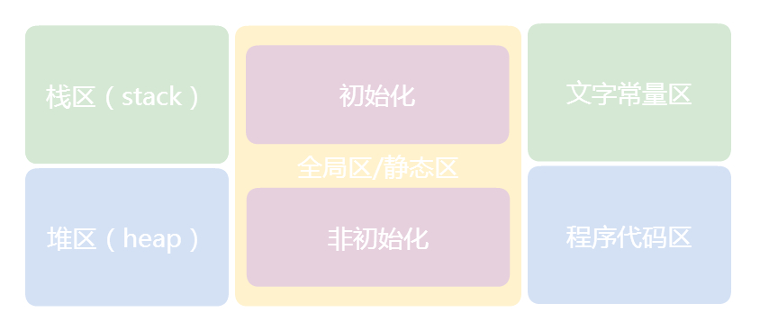
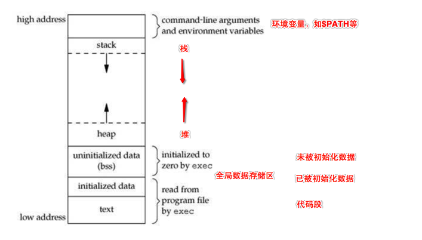
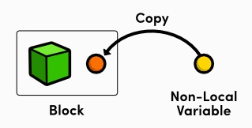
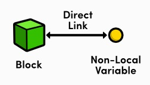
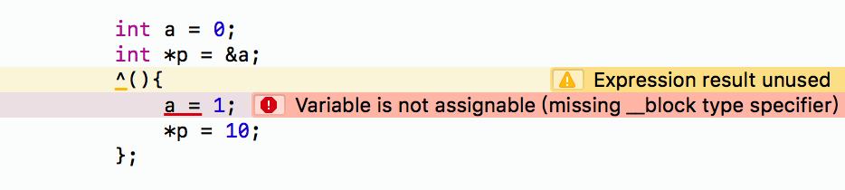
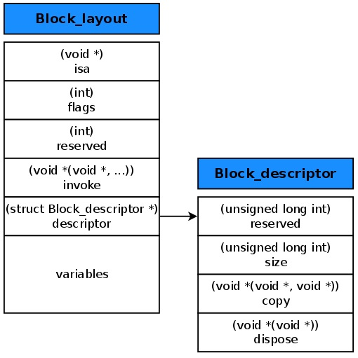

# block
#程序员/iOS/内存管理


### 关于内存知识






内存的五个存储区域：
栈区（stack）：由系统自动分配，一般存放函数参数值、局部变量的值等。由编译器自动创建与释放。其操作方式类似于数据结构中的栈，即后进先出、先进后出的原则。

例如：在函数中申明一个局部变量int b;系统自动在栈中为b开辟空间。

堆区（heap）：一般由程序员申请并指明大小，最终也由程序员释放。如果程序员不释放，程序结束时可能会由OS回收。对于堆区的管理是采用链表式管理的，操作系统有一个记录空闲内存地址的链表，当接收到程序分配内存的申请时，操作系统就会遍历该链表，遍历到一个记录的内存地址大于申请内存的链表节点，并将该节点从该链表中删除，然后将该节点记录的内存地址分配给程序。

全局区/静态区：顾名思义，全局变量和静态变量存储在这个区域。只不过初始化的全局变量和静态变量存储在一块，未初始化的全局变量和静态变量存储在一块。程序结束后由系统释放。

文字常量区：这个区域主要存储字符串常量。程序结束后由系统释放。

程序代码区：这个区域主要存放函数体的二进制代码。

一个非常经典的例子
```
//main.cpp
int a = 0; // 全局初始化区
char *p1; // 全局未初始化区
main {
    int b; // 栈
    char s[] = "abc"; // 栈
    char *p2; // 栈
    char *p3 = "123456"; // 123456\0在常量区，p3在栈上
    static int c =0； // 全局静态初始化区
    p1 = (char *)malloc(10);
    p2 = (char *)malloc(20); // 分配得来的10和20字节的区域就在堆区
    strcpy(p1, "123456"); // 123456\0在常量区，这个函数的作用是将"123456" 这串字符串复制一份放在p1申请的10个字节的堆区域中。
    // p3指向的"123456"与这里的"123456"可能会被编译器优化成一个地址。
}
```


### 关于闭包

> 闭包就是一个函数，或者一个指向函数的指针，加上这个函数执行的非局部变量。  
也就是闭包是有两部分组成的：代码块，代码块外部的变量；

### block基础

我们来看看block的原型：
`NSString * ( ^ myBlock )( int );`
上面的代码声明了一个block(^)原型，名字叫做myBlock，包含一个int型的参数，返回值为NSString类型的指针。

下面来看看block的定义：
```
myBlock = ^( int paramA )
{
    return [ NSString stringWithFormat: @"Passed number: %i", paramA ];
};
```
上面的代码中，将一个函数体赋值给了myBlock变量，其接收一个名为paramA的参数，返回一个NSString对象。

注意：一定不要忘记block后面的分号。

定义好block后，就可以像使用标准函数一样使用它了：
`myBlock(7);`
由于block数据类型的语法会降低整个代码的阅读性，所以常使用typedef来定义block类型。例如，下面的代码创建了GetPersonEducationInfo和GetPersonFamilyInfo两个新类型，这样我们就可以在下面的方法中使用更加有语义的数据类型。
```
// Person.h
#import // Define a new type for the block
typedef NSString * (^GetPersonEducationInfo)(NSString *);
typedef NSString * (^GetPersonFamilyInfo)(NSString *);
@interface Person : NSObject
- (NSString *)getPersonInfoWithEducation:(GetPersonEducationInfo)educationInfo
    andFamily:(GetPersonFamilyInfo)familyInfo;

@end
```


### block中变量的复制与修改

对于block外的变量引用，block默认是将其复制到其数据结构中来实现访问的，如下图：




通过block进行闭包的变量是 -const- (::*不能修改，但并不是const::) 的。也就是说不能在block中直接修改这些变量。
有时候确实需要在block中处理变量，我们可以用__block关键字来声明变量，这样就可以在block中修改变量了。
对于用__block修饰的外部变量引用，block是复制其引用地址来实现访问的，如下图：




下面的代码可以看到，修改a的值是不行的，可通过指针则是可以的。

具体原因在[Block技巧与底层解析 - 简书](http://www.jianshu.com/p/51d04b7639f1)中有讲到。自己细看吧


### block的数据结构定义



对应代码：
```objective-c
struct Block_descriptor {
    unsigned long int reserved;
    unsigned long int size;
    void (*copy)(void *dst, void *src);
    void (*dispose)(void *);
};
struct Block_layout {
    void *isa;
    int flags;
    int reserved;
    void (*invoke)(void *, ...);
    struct Block_descriptor *descriptor;
    /* Imported variables. */
};
```

isa指针：指向表明该block类型的类。

flags：按bit位表示一些block的附加信息，比如判断block类型、判断block引用计数、判断block是否需要执行辅助函数等。

reserved：保留变量，我的理解是表示block内部的变量数。

invoke：函数指针，指向具体的block实现的函数调用地址。

descriptor：block的附加描述信息，比如保留变量数、block的大小、进行copy或dispose的辅助函数指针。

variables：因为block有闭包性，所以可以访问block外部的局部变量。这些variables就是复制到结构体中的外部局部变量或变量的地址。

### block的类型
三种类型：
	1. _NSConcreteGlobalBlock：全局的静态block，不会访问任何外部变量，不会涉及到任何拷贝，比如一个空的block。
	2. _NSConcreteStackBlock：保存在栈中的block，当函数返回时被销毁。
	3. _NSConcreteMallocBlock：保存在堆中的block，当引用计数为0时被销毁。该类型的block都是由_NSConcreteStackBlock类型的block从栈中复制到堆中形成的。例如下面代码中，在exampleB_addBlockToArray方法中的block还是_NSConcreteStackBlock类型的，在exampleB方法中就被复制到了堆中，成为_NSConcreteMallocBlock类型的block：
```objective-c
void exampleB_addBlockToArray(NSMutableArray *array) {
    char b = 'B';
    [array addObject:^{
            printf("%c\n", b);
    }];
}
void exampleB() {
    NSMutableArray *array = [NSMutableArray array];
    exampleB_addBlockToArray(array);
    void (^block)() = [array objectAtIndex:0];
    block();
}
```

关于栈block和全局block的一个例子

```objective-c
void (^globalBlock)() = ^{

};

int main(int argc, const char * argv[]) {
    @autoreleasepool {
        void (^stackBlock1)() = ^{

        };
    }
    return 0;
}
```

上面的代码转成C++后：
```c++
// globalBlock
struct __globalBlock_block_impl_0 {
  struct __block_impl impl;
  struct __globalBlock_block_desc_0* Desc;
  __globalBlock_block_impl_0(void *fp, struct __globalBlock_block_desc_0 *desc, int flags=0) {
    impl.isa = &_NSConcreteGlobalBlock;
    impl.Flags = flags;
    impl.FuncPtr = fp;
    Desc = desc;
  }
};
...

// stackBlock
struct __main_block_impl_0 {
  struct __block_impl impl;
  struct __main_block_desc_0* Desc;
  __main_block_impl_0(void *fp, struct __main_block_desc_0 *desc, int flags=0) {
    impl.isa = &_NSConcreteStackBlock;
    impl.Flags = flags;
    impl.FuncPtr = fp;
    Desc = desc;
  }
};

int main(int argc, const char * argv[]) {
    /* @autoreleasepool */ { __AtAutoreleasePool __autoreleasepool;
        void (*stackBlock)() = (void (*)())&__main_block_impl_0((void *)__main_block_func_0, &__main_block_desc_0_DATA);
    }
    return 0;
}

```

总结一下：

_NSConcreteGlobalBlock类型的block要么是空block，要么是不访问任何外部变量的block。它既不在栈中，也不在堆中，在全局区。

_NSConcreteStackBlock类型的block有闭包行为，也就是有访问外部变量，并且该block仅且仅有有一次执行，因为栈中的空间是可重复使用的，所以当栈中的block执行一次之后就被清除出栈了，所以无法多次使用。

_NSConcreteMallocBlock类型的block有闭包行为，并且该block需要被多次执行。当需要多次执行时，就会把该block从栈中复制到堆中，供以多次执行。

前面两种类型是可以直接创建的，而第三种需要在拷贝时创建的。

### 编译器做了什么

```objective-c
typedef void(^BlockA)(void);
__attribute__((noinline))
void runBlockA(BlockA block) {
    block();
}
void doBlockA() {
    BlockA block = ^{
        // Empty block
    };
    runBlockA(block);
}
```

> 注意：如果block的创建和调用都在一个函数里面，那么优化器(optimiser)可能会对代码做优化处理，从而导致我们看不到编译器中的一些操作，所以用__attribute__((noinline))给函数runBlockA添加noinline，这样优化器就不会在doBlockA函数中对runBlockA的调用做内联优化处理。  

将上面的OC代码转换成C++代码，调用和执行流程就很清楚了
```c++
#import __attribute__((noinline))
void runBlockA(struct Block_layout *block) {
    block->invoke();
}
void block_invoke(struct Block_layout *block) {
    // Empty block function
}
void doBlockA() {
    struct Block_descriptor descriptor;
    descriptor->reserved = 0;
    descriptor->size = 20;
    descriptor->copy = NULL;
    descriptor->dispose = NULL;
    struct Block_layout block;
    block->isa = _NSConcreteGlobalBlock;
    block->flags = 1342177280;
    block->reserved = 0;
    block->invoke = block_invoke;
    block->descriptor = descriptor;
    runBlockA(&block);
}
```


### copy()和dispose()
上文中提到，如果我们想要在以后继续使用某个block，就必须要对该block进行拷贝操作，即从栈空间复制到堆空间。所以拷贝操作就需要调用Block_copy()函数，block的descriptor中有一个copy()辅助函数，该函数在Block_copy()中执行，用于当block需要拷贝对象的时候，拷贝辅助函数会retain住已经拷贝的对象。

既然有有copy那么就应该有release，与Block_copy()对应的函数是Block_release()，它的作用不言而喻，就是释放我们不需要再使用的block，block的descriptor中有一个dispose()辅助函数，该函数在Block_release()中执行，负责做和copy()辅助函数相反的操作，例如释放掉所有在block中拷贝的变量等。


### self隐式循环引用

```objective-c
@implementation Person
{
    int _a;
    void (^_block)();
}
- (void)test
{
  void (^_block)() = ^{
        _a = 10;
    };
}

@end
```

转换后

```c++
struct __Person__test_block_impl_0 {
  struct __block_impl impl;
  struct __Person__test_block_desc_0* Desc;
  // 可以看到，block强引用了self
  Person *self;
  __Person__test_block_impl_0(void *fp, struct __Person__test_block_desc_0 *desc, Person *_self, int flags=0) : self(_self) {
    impl.isa = &_NSConcreteStackBlock;
    impl.Flags = flags;
    impl.FuncPtr = fp;
    Desc = desc;
  }
};
static void __Person__test_block_func_0(struct __Person__test_block_impl_0 *__cself) {
  Person *self = __cself->self; // bound by copy

        (*(int *)((char *)self + OBJC_IVAR_$_Person$_a)) = 10;
    }
static void __Person__test_block_copy_0(struct __Person__test_block_impl_0*dst, struct __Person__test_block_impl_0*src) {_Block_object_assign((void*)&dst->self, (void*)src->self, 3/*BLOCK_FIELD_IS_OBJECT*/);}

static void __Person__test_block_dispose_0(struct __Person__test_block_impl_0*src) {_Block_object_dispose((void*)src->self, 3/*BLOCK_FIELD_IS_OBJECT*/);}

static struct __Person__test_block_desc_0 {
  size_t reserved;
  size_t Block_size;
  void (*copy)(struct __Person__test_block_impl_0*, struct __Person__test_block_impl_0*);
  void (*dispose)(struct __Person__test_block_impl_0*);
} __Person__test_block_desc_0_DATA = { 0, sizeof(struct __Person__test_block_impl_0), __Person__test_block_copy_0, __Person__test_block_dispose_0};

static void _I_Person_test(Person * self, SEL _cmd) {
  void (*_block)() = (void (*)())&__Person__test_block_impl_0((void *)__Person__test_block_func_0, &__Person__test_block_desc_0_DATA, self, 570425344);
}

```

### block变量捕获对block类型的影响
```

-(void)testBlock{

    int i = 10;
    void (^block)() = ^{i;};
    
    __weak void (^weakBlock)() = ^{i;};
    
    void (^stackBlock)() = ^{};
    
    // ARC情况下
    
    // 创建时，都会在栈中
    // <__NSStackBlock__: 0x7fff5fbff730>
    NSLog(@"%@", ^{i;});
    
    // 因为block为strong类型，且捕获了外部变量，所以赋值时，自动进行了copy
    // <__NSMallocBlock__: 0x100206920>
    NSLog(@"%@", block);
    
    // 如果是weak类型的block，依然不会自动进行copy
    // <__NSStackBlock__: 0x7fff5fbff728>
    NSLog(@"%@", weakBlock);
    
    // 如果block是strong类型，并且没有捕获外部变量，那么就会转换成__NSGlobalBlock__
    // <__NSGlobalBlock__: 0x100001110>
    NSLog(@"%@", stackBlock);
    
}

```