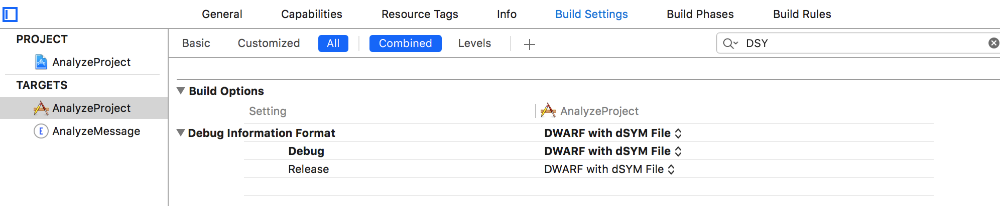

# dSYM
#程序员/iOS/项目设置

#### 获取文件
默认情况下debug是不生成这个文件的，需要在Xcode中设置一下。

#### 作用
1. 使用Instruments对App进行检测时，需要这个文件才能在Instruments中看到对应的代码并进行跳转。
[Instruments User Guide: Map Data to Source Code](https://developer.apple.com/library/content/documentation/DeveloperTools/Conceptual/InstrumentsUserGuide/LocatingSymbolsforYourData.html)
2. 线上Crash分析
 [crash日志符号化，以分析崩溃 - 简书](http://www.jianshu.com/p/cf279d830482)
[Technical Note TN2151: Understanding and Analyzing Application Crash Reports](https://developer.apple.com/library/content/technotes/tn2151/_index.html)
