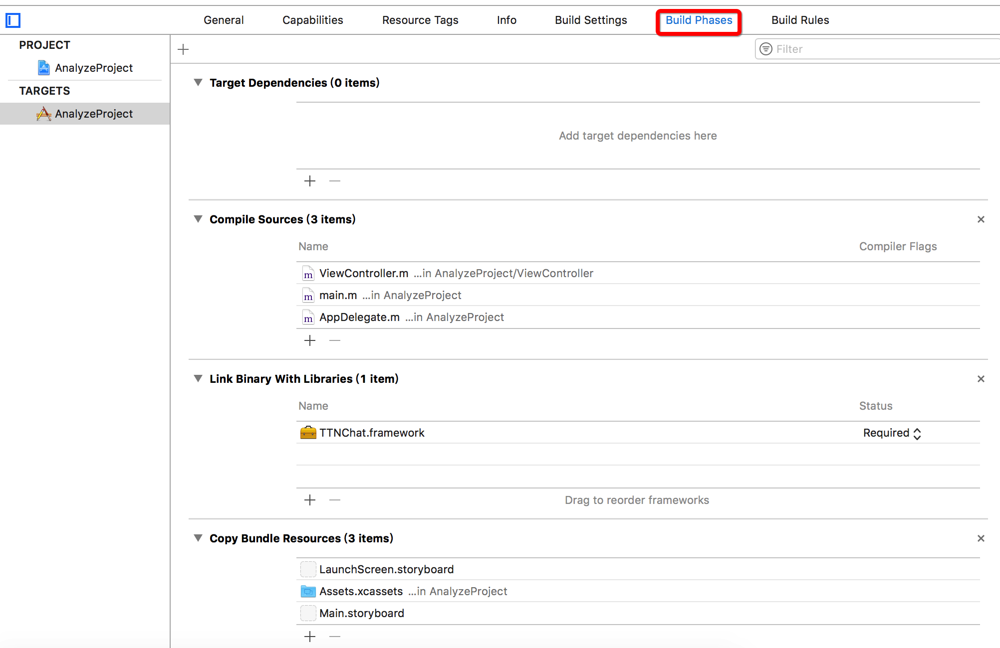
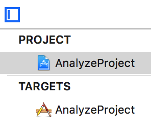
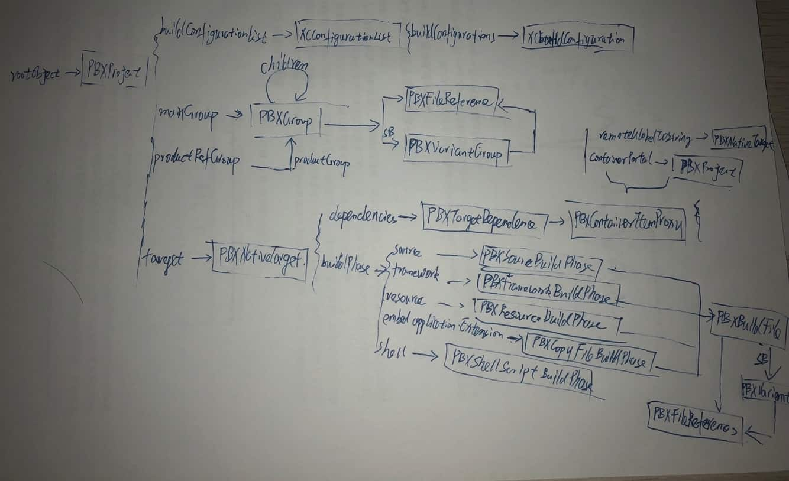

# pbxproj
#程序员/iOS/项目设置


当年还是小白的时候，因为git用不好，所以合代码的时候经常遇到项目文件冲突。当年解冲突，解得我也是一脸懵逼。所以，如今回过头来再深入解析一下这个文件。

### 文件位置
`project.pbxproj`这个文件在`xcodeproj`的包里面。显示包内容就可以查看到。

### 文件内容
为了解析文件，这里新建一个Objective-C iOS项目。这样文件内容相对要少很多。后续再通过添加文件、group with folder、group without folder等操作来查看这个文件的变化。
虽然是新建的项目，其中的内容也不少。一层一层的来看吧

#### 一级结构
先去掉深层级的内容，最后只留下了下面的几个属性。
```
// !$*UTF8*$!
{
	archiveVersion = 1;
	classes = {
	};
	objectVersion = 48;
	objects = {
	};
	rootObject = 095447A11FD01E2600D563EA /* Project object */;
}

```

1. archiveVersion
不知道有啥用，所有项目都是1。pass
2. classes
根据名字来猜测是用来指示类文件的。可，目前我没有遇到它不为空的时候。so，不知道有啥用，pass
3. objectVersion
用来指示`objects `结构所使用的版本。这个版本和生成项目所使用的XCode版本有关。现在`Version 9.1 (9B55)`默认是48。
手欠的我直接把这个版本改成40，然后项目就打不开了
>  Failed to load project at '_Users_mac_Desktop_Project_Lab_AnalyzeProject/AnalyzeProject.xcodeproj', incompatible project version.  
试了一下，41不行42就可以了。（最后还是改回去好了）这个属性目前没啥用，pass
4. objects
应该算是一个字典吧。记录了项目里所有的内容：文件、文件夹、group 😀and so on~
文章后面的内容基本都是围绕这个属性展开
5. rootObject
根对象、线头、项目文件自身
我的理解是：Xcode项目的本质其实还是文件夹。文件夹里不同的文件扮演不同的角色。`rootObject `就是这个根目录。XCode需要从根目录开始解析。

五个部分中重要的就是objects和rootObject。objects中包含了很多内容。所以接下来，先看下objects中的内容（objectVersion==48，不同版本，结构不一样）。

- - - -

### objects分解
objects也可以看成是字典，key是Xcode自己生成的UUID保证唯一。
新项目自动添加：
1. PBXBuildFile
2. PBXFileReference
3. PBXFrameworksBuildPhase
4. PBXGroup
5. PBXNativeTarget
6. PBXProject
7. PBXResourcesBuildPhase
8. PBXSourcesBuildPhase
9. PBXVariantGroup
10. XCBuildConfiguration
11. XCConfigurationList

创建Target(Today extension、iMessage ...)：
1. PBXContainerItemProxy
2. PBXCopyFilesBuildPhase
3. PBXTargetDependency
pod or 手动添加脚本
1. PBXShellScriptBuildPhase
上面的这些段是从文件的注释中提取的，也就是这些段没有独立的key，所有的段内容都放在一起。通过UUID进行关联。

- - - -

#### PBXBuildFile
包含源代码(.m)、SB、资源文件、framework。对应下面这个设置界面



- - - -

#### PBXFileReference
文件列表，所有被项目引用的文件（ source files, headers, libraries, frameworks, XcodeConfig files, other projects…）都被包含在这个段里。

eg：
```
095447AD1FD01E2600D563EA /* AppDelegate.m */ = {isa = PBXFileReference; lastKnownFileType = sourcecode.c.objc; path = AppDelegate.m; sourceTree = "<group>"; };
```

说一下其中的两个字段：`path` && `sourceTree`
我尝试改变文件的本地路径，但这里的path并不会改变。所以path的值是根据sourceTree的类型来设定的。`sourceTree：PBXSourceTree`

> Absolute	The file path is absolute path.  
> Source	The file path is relative to the project path.  
> Group		The file path is relative to the group the file is in.  
> Build		The file path is relative to build products path.  
> Developer	The file path is relative to the developer directory.  
> Sdk		The file path is relative to SDK path.  

实验：我在桌面上创建一个Test.m文件，然后添加到项目中
```
095447C71FD0F30400D563EA /* Test.m */ = {isa = PBXFileReference; fileEncoding = 4; lastKnownFileType = sourcecode.c.objc; name = Test.m; path = ../../../../Test.m; sourceTree = "<group>"; };
```

所以path的路径是相对于sourceTree的。这里的sourceTree是group类型，所以是path相对于组的路径。而当文件的路径的时候，它所在的group会改变，但path是不变的。后面会讲到通过group一级一级的查找到文件。

- - - -

### PBXProject
```Swift
		095447A11FD01E2600D563EA /* Project object */ = {
			isa = PBXProject;
			attributes = {
				LastUpgradeCheck = 0910;
				ORGANIZATIONNAME = Bear;
				TargetAttributes = {
					095447A81FD01E2600D563EA = {
						CreatedOnToolsVersion = 9.1;
						ProvisioningStyle = Automatic;
					};
				};
			};
			buildConfigurationList = 095447A41FD01E2600D563EA /* Build configuration list for PBXProject "AnalyzeProject" */;
			compatibilityVersion = "Xcode 8.0";
			developmentRegion = en;
			hasScannedForEncodings = 0;
			knownRegions = (
				en,
				Base,
			);
			mainGroup = 095447A01FD01E2600D563EA;
			productRefGroup = 095447AA1FD01E2600D563EA /* Products */;
			projectDirPath = "";
			projectRoot = "";
			targets = (
				095447A81FD01E2600D563EA /* AnalyzeProject */,
			);
		};
```

对应Xcode内容



- - - -

到此已经介绍了三个重要的属性：PBXProject可以说是头，而PBXBuildFile & PBXFileReference算是尾。通过这三个可以基本串起整个文件内容
> 上文提到的：  
> 上面的这些段是从文件的注释中提取的，也就是这些段没有独立的key，所有的段内容都放在一起。通过UUID进行关联。  

下面来画一张图(凑合看吧)




- - - -
### 其它属性

#### PBXFrameworksBuildPhase

framework引用。
1. 添加第三方framework
* `PBXBuildFile & PBXFileReference`中会添加相关的KV。
* `PBXFrameworksBuildPhase`中的file字段会添加文件UUID。
* 同时在PBXGroup（下面会讲到）中新增加了一个Group——Framework。
在其中的children字段添加相应的文件UUID

_UUID链接_
`PBXFrameworksBuildPhase-> PBXBuildFile-> PBXFileReference`
`PBXGroup.children-> PBXFileReference`

2. 添加系统framework
eg:添加`NotificationCenter.framework`
第一次添加时，PBXFileReference中会添加相对的KV，但是PBXBuildFile中没有增加内容。当然从Xcode的target配置界面上也看不到。
第二次添加的时候，PBXBuildFile才添加相应的KV。不知道为啥

PBXFrameworksBuildPhase段会有多个KV对。每一个对应一个Target

- - - -

参考文章：

[Monobjc](http://www.monobjc.net/xcode-project-file-format.html)

[Xcode工程文件project.pbxproj小结 - 简书](http://www.jianshu.com/p/e82ec6a56fc2)

[Let's Talk About project.pbxproj](http://yulingtianxia.com/blog/2016/09/28/Let-s-Talk-About-project-pbxproj/)