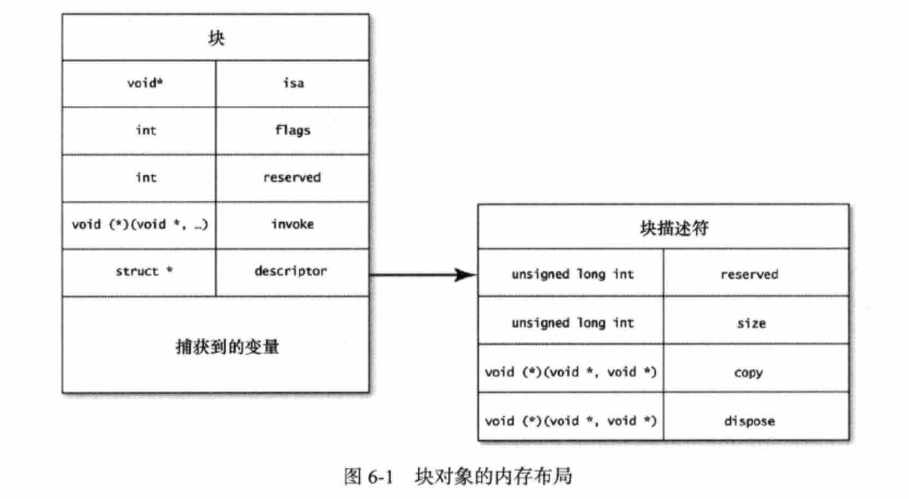

# What’s Block
#程序员/iOS/Block

```objc

#import "BlockDemo.h"
@interface BlockDemo()

@end


@implementation BlockDemo
-(void)start {
    void (^testBlock)(void) = ^{
        
        NSLog(@"Hello World!");
    };
    
    testBlock();
}
@end

```


`clang -rewrite-objc BlockDemo.m`生成对应的c++代码

```cpp
struct __block_impl {
  void *isa;
  int Flags;
  int Reserved;
  void *FuncPtr;
};


// @implementation BlockDemo

struct __BlockDemo__start_block_impl_0 {
  struct __block_impl impl;
  struct __BlockDemo__start_block_desc_0* Desc;

  //构造函数
  //这里fp=__BlockDemo__start_block_func_0 desc=__BlockDemo__start_block_desc_0_DATA
  __BlockDemo__start_block_impl_0(void *fp, struct __BlockDemo__start_block_desc_0 *desc, int flags=0) {
    impl.isa = &_NSConcreteStackBlock;
    impl.Flags = flags;
    impl.FuncPtr = fp;
    Desc = desc;
  }
};


//testBlock函数体
static void __BlockDemo__start_block_func_0(struct __BlockDemo__start_block_impl_0 *__cself) {


        NSLog((NSString *)&__NSConstantStringImpl__var_folders_k5_4r1bsz6j5f9fcb_rgsn5402h0000gn_T_BlockDemo_cad469_mi_0);
    }


//block 描述，初始为空，感觉没啥用 =。=
static struct __BlockDemo__start_block_desc_0 {
  size_t reserved;
  size_t Block_size;
} __BlockDemo__start_block_desc_0_DATA = { 0, sizeof(struct __BlockDemo__start_block_impl_0)};


static void _I_BlockDemo_start(BlockDemo * self, SEL _cmd) {

    void (*testBlock)(void) = &__BlockDemo__start_block_impl_0(__BlockDemo__start_block_func_0, &__BlockDemo__start_block_desc_0_DATA);
    //这里的testBlock就是 __BlockDemo__start_block_impl_0 对象


    ((void (*)(__block_impl *))((__block_impl *)testBlock)->FuncPtr)((__block_impl *)testBlock);
    //testBlock是__BlockDemo__start_block_impl_0类型，而他的第一个变量就是impl，所以(__block_impl *)testBlock和testBlock->impl是一个东西
    //((__block_impl *)testBlock)->FuncPtr) 就是 __BlockDemo__start_block_func_0 
    //这个时候的入参：(__block_impl *)testBlock 就是impl，形参需要的类型是__BlockDemo__start_block_impl_0，但是__block_imp。两者只有desc的差别。然，并不知道为啥要这么搞
}

// @end

```

今天在看OC 52时发出的一张图。虽然和现在的代码有点差异，但图本身还不错，放在这里好了
