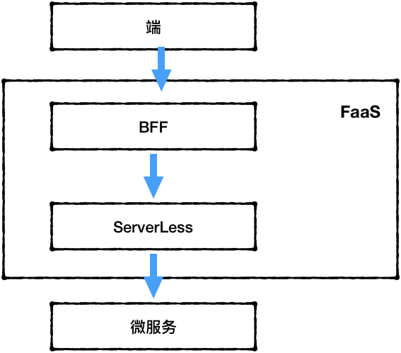

# Serverless

对于大公司而言，核心业务肯定还是在自己的手上的。所以，对于后台微服务的开发和运维都得自己来。但对于端开发而言，后台服务向微服务的转变后，端上开发起来就有点痛苦了。

面向微服务开发的两个应对方案

1. 端上自己调用各微服务，然后在端上裁剪组装
2. BFF

对于第一个，最大的问题就是重复工作。要知道端可不是一个（iOS Android 小程序 H5）。但第二个方案就需要BFF有足够的稳定性了。在BFF稳定的前提下，BFF也可以说是一个非常好的方案。

然后端上把跨端打通。一个需求过来，在微服务健全的前提下，基本全栈了。

这个感觉和苹果的iCloud有些像。哎，可惜，苹果还是太封闭了。