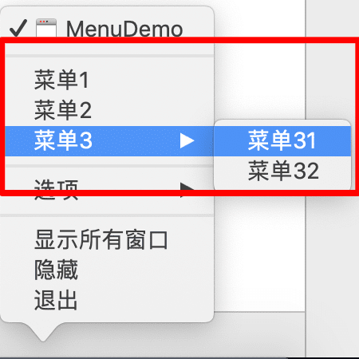
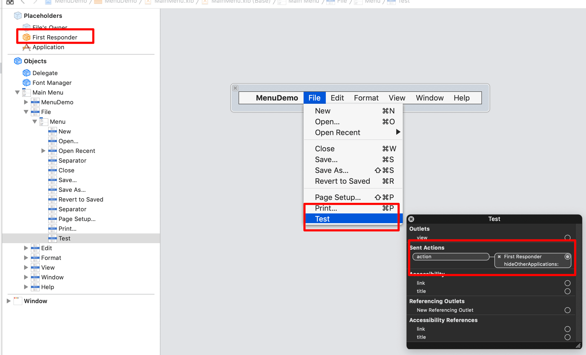
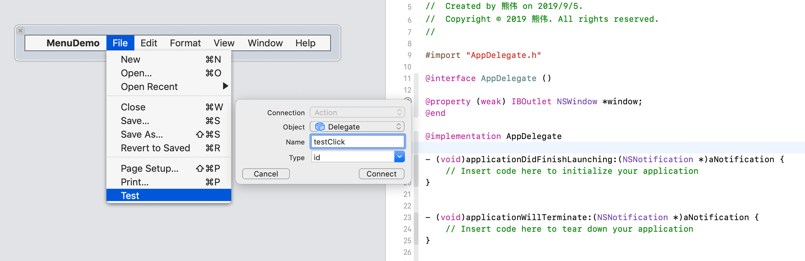
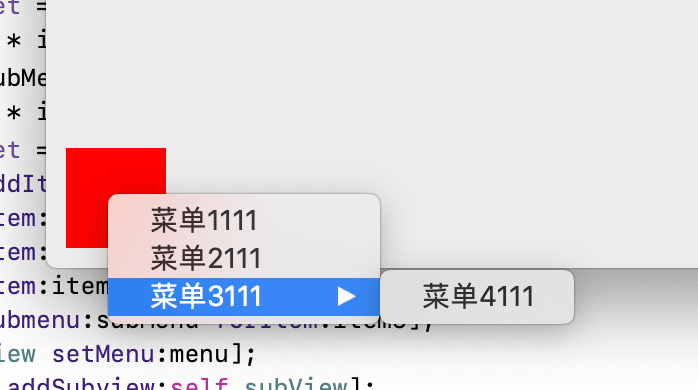
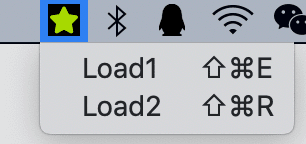
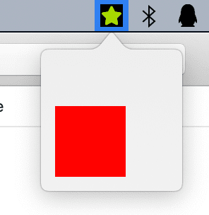

# Menu

[Git Demo](https://github.com/CreazyBear/MacAppLesson/tree/master/MenuDemo)

## 一、Docker菜单


```objc
@implementation AppDelegate
-(NSMenu *)applicationDockMenu:(NSApplication *)sender {
    NSMenu * menu = [[NSMenu alloc]initWithTitle:@"Menu"];
    NSMenuItem * item1 = [[NSMenuItem alloc]initWithTitle:@"菜单1"
                                                   action:@selector(click:)
                                            keyEquivalent:@""];
    item1.target = self;
    
    NSMenuItem * item2 = [[NSMenuItem alloc]initWithTitle:@"菜单2"
                                                   action:@selector(click:)
                                            keyEquivalent:@""];
    item2.target = self;
    
    NSMenuItem * item3 = [[NSMenuItem alloc]initWithTitle:@"菜单3"
                                                   action:@selector(click:)
                                            keyEquivalent:@""];
    
    NSMenu * subMenu = [[NSMenu alloc]initWithTitle:@"subMenu"];
    NSMenuItem * item31 = [[NSMenuItem alloc]initWithTitle:@"菜单31"
                                                    action:@selector(click:)
                                             keyEquivalent:@""];
    item31.target = self;
    
    [subMenu addItem:item31];
    NSMenuItem * item32 = [[NSMenuItem alloc]initWithTitle:@"菜单32"
                                                    action:@selector(click:)
                                             keyEquivalent:@""];
    item32.target = self;
    
    [subMenu addItem:item32];
    
    [menu addItem:item1];
    [menu addItem:item2];
    [menu addItem:item3];
    [menu setSubmenu:subMenu forItem:item3];
    return menu;
}

-(void)click:(NSMenu*)sender {
    NSLog(@"%@", sender.title);
}
@end
```

## 二、应用菜单
First Responder、File’s Owner和Application中定义了相关多的功能。可以直接连过去。


当然，还可以直接连到AppDelegate中，创建自定义的方法



## 三、右键弹出菜单


右键弹出菜单是作用在View上的。那是不是随便一个NSView都可以呢？好像还真是的。
```objc
        NSView * vcView = [[NSView alloc] initWithFrame:frame];
        self.view = vcView;
        
        NSMenu * menu = [[NSMenu alloc]initWithTitle:@"Menu"];
        NSMenuItem * item1 = [[NSMenuItem alloc]initWithTitle:@"菜单1" action:@selector(click:) keyEquivalent:@""];
        item1.target = self;
        NSMenuItem * item2 = [[NSMenuItem alloc]initWithTitle:@"菜单2" action:@selector(click:) keyEquivalent:@""];
        item2.target = self;
        NSMenuItem * item3 = [[NSMenuItem alloc]initWithTitle:@"菜单3" action:@selector(click:) keyEquivalent:@""];
        NSMenu * subMenu = [[NSMenu alloc]initWithTitle:@"subMenu"];
        NSMenuItem * item4 = [[NSMenuItem alloc]initWithTitle:@"菜单4" action:@selector(click:) keyEquivalent:@""];
        item4.target = self;
        [subMenu addItem:item4];
        [menu addItem:item1];
        [menu addItem:item2];
        [menu addItem:item3];
        [menu setSubmenu:subMenu forItem:item3];
        [self.view setMenu:menu];
```


## 四、状态栏（NSStatusItem）添加菜单

```objc
- (void)applicationDidFinishLaunching:(NSNotification *)aNotification {
    
    self.statusItem = [[NSStatusBar systemStatusBar] statusItemWithLength:NSVariableStatusItemLength];
    self.statusItem.button.image = [NSImage imageNamed:@"statuBarIcon"];
    self.statusItem.button.toolTip = @"statusItem";
    self.statusItem.button.highlighted = YES;
    
    NSMenu *subMenu = [[NSMenu alloc] initWithTitle:@"Load_TEXT"];
    [subMenu addItemWithTitle:@"Load1"action:@selector(click:) keyEquivalent:@"E"];
    [subMenu addItemWithTitle:@"Load2"action:@selector(click:) keyEquivalent:@"R"];
    self.statusItem.menu = subMenu;    
}

```


当然，状态栏完全可以扩展一个popover出来。

```objc
- (void)applicationDidFinishLaunching:(NSNotification *)aNotification {
    
    self.statusItem = [[NSStatusBar systemStatusBar] statusItemWithLength:NSVariableStatusItemLength];
    self.statusItem.button.image = [NSImage imageNamed:@"statuBarIcon"];
    self.statusItem.button.toolTip = @"statusItem";
    self.statusItem.button.highlighted = YES;
    [self.statusItem.button setAction:@selector(popoverSwitch)];
    
    if (!_popover) {
        _popover = [[NSPopover alloc] init];
        _popover.contentViewController = [[FJViewController alloc] initWithFrame:NSMakeRect(0, 0, 100, 100)];
        _popover.behavior = NSPopoverBehaviorApplicationDefined;
        [_popover setAnimates:NO];
    }
    
    [self.popover showRelativeToRect:NSZeroRect ofView:self.statusItem.button preferredEdge:NSRectEdgeMinY];
    
}
```

## 五、应用启动时不在Docker中显示图标

    ```xml
    <!-- Application is agent (UIElement) = true -->
    <key>LSUIElement</key>
	<true/>
    ```

## 六、Toolbar

对于toolbar中每一项的创建是放在delegate中实现的

1. 创建Toolbar
   
```objc
- (void)setUpToolbar {
    NSToolbar *toolbar = [[NSToolbar alloc] initWithIdentifier:@"AppToolbar"];
    [toolbar setAllowsUserCustomization:NO];
    [toolbar setAutosavesConfiguration:NO];
    [toolbar setDisplayMode:NSToolbarDisplayModeIconAndLabel];
    [toolbar setSizeMode:NSToolbarSizeModeSmall];
    [toolbar setDelegate:self];
    [self.view.window setToolbar:toolbar];
}

```

2. 创建item

```objc
#pragma mark - NSToolbarDelegate
//所有的item 标识
- (NSArray *)toolbarAllowedItemIdentifiers:(NSToolbar *)toolbar {
    return @[@"FontSetting",@"Save"];
}

//实际显示的item 标识
- (NSArray *)toolbarDefaultItemIdentifiers:(NSToolbar *)toolbar {
    return @[@"FontSetting",@"Save"];
}

//根据item 标识 返回每个具体的NSToolbarItem对象实例

- (NSToolbarItem *)toolbar:(NSToolbar *)toolbar itemForItemIdentifier:(NSString *)itemIdentifier willBeInsertedIntoToolbar:(BOOL)flag {
    
    NSToolbarItem *toolbarItem = [[NSToolbarItem alloc] initWithItemIdentifier:itemIdentifier];
    
    if ([itemIdentifier isEqualToString:@"FontSetting"]) {
        [toolbarItem setLabel:@"Font"];
        [toolbarItem setPaletteLabel:@"Font"];
        [toolbarItem setToolTip:@"Font Setting"];
        [toolbarItem setImage:[NSImage imageNamed:@"FontSetting"]];
        toolbarItem.tag = 1;
        
    }
    else if ([itemIdentifier isEqualToString:@"Save"]) {
        [toolbarItem setLabel:@"Save"];
        [toolbarItem setPaletteLabel:@"Save"];
        [toolbarItem setToolTip:@"Save File"];
        [toolbarItem setImage:[NSImage imageNamed:@"Save"]];
        toolbarItem.tag = 2;
    }
    else {
        toolbarItem = nil;
    }
    
    [toolbarItem setMinSize:CGSizeMake(25, 25)];
    [toolbarItem setMaxSize:CGSizeMake(100, 100)];
    [toolbarItem setTarget:self];
    [toolbarItem setAction:@selector(toolbarItemClicked:)];
    return toolbarItem;
}

-(void)toolbarItemClicked:(id)sender {
    
}

```

3. 自定义

```objc
[toolbar setAllowsUserCustomization:YES];
```


