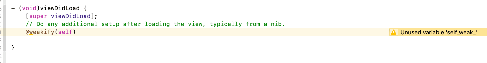
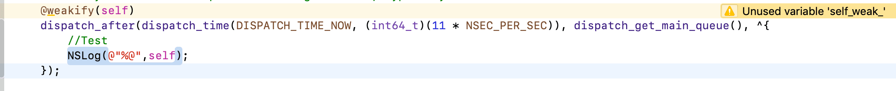
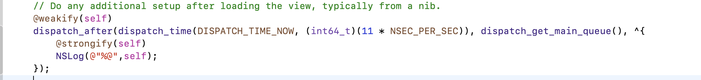

# @weakify
#程序员/iOS/Block


```objc
@weakify(self)

// weakify的定义如下：
#define weakify(...) \ // ... = self
	ext_keywordify \
	metamacro_foreach_cxt(ext_weakify_,, __weak, __VA_ARGS__) // __VA_ARGS__ = self

// 而ext_keywordify定义如下：
#define ext_keywordify autoreleasepool {}

// 所以将weakify还原一次：
#define weakify(...) \ // ... = self
	autoreleasepool {} \
	metamacro_foreach_cxt(ext_weakify_,, __weak, __VA_ARGS__) // __VA_ARGS__ = self

// 再来看下metamacro_foreach_cxt的定义：
#define metamacro_foreach_cxt(MACRO, SEP, CONTEXT, ...) \ // ... = self
        metamacro_concat(metamacro_foreach_cxt, metamacro_argcount(__VA_ARGS__))   (MACRO, SEP, CONTEXT, __VA_ARGS__) // __VA_ARGS__ = self

//直接放进去有点凌乱，我们先看一下metamacro_concat这个是啥
#define metamacro_concat(A, B) \
        metamacro_concat_(A, B)

#define metamacro_concat_(A, B) A ## B

// 根据metamacro_concat和metamacro_concat_的定义，这个宏的意思就是把两个变量名连接起来
// 所以我们回到 metamacro_foreach_cxt 这个宏。这个宏有三个参数加可变参数
// 第一个参数 ext_weakify_是一个宏定义
// 第二个参数是分隔符 这里传的空
// 第三个参数是 __weak
// 可变参数部分，这里只有一个self。使用 __VA_ARGS__ 表示


// 关于 metamacro_argcount(__VA_ARGS__)
#define metamacro_argcount(...) \ // ... = self
        metamacro_at(20, __VA_ARGS__, 20, 19, 18, 17, 16, 15, 14, 13, 12, 11, 10, 9, 8, 7, 6, 5, 4, 3, 2, 1)  // __VA_ARGS__ = self

#define metamacro_at(N, ...) \ // ... = self, 20, 19, 18, 17, 16, 15, 14, 13, 12, 11, 10, 9, 8, 7, 6, 5, 4, 3, 2, 1
        metamacro_concat(metamacro_at, N)(__VA_ARGS__)  // __VA_ARGS__ = self, 20, 19, 18, 17, 16, 15, 14, 13, 12, 11, 10, 9, 8, 7, 6, 5, 4, 3, 2, 1

metamacro_argcount(__VA_ARGS__) = metamacro_at20(self, 20, 19, 18, 17, 16, 15, 14, 13, 12, 11, 10, 9, 8, 7, 6, 5, 4, 3, 2, 1)

//而
#define metamacro_at20(_0, _1, _2, _3, _4, _5, _6, _7, _8, _9, _10, _11, _12, _13, _14, _15, _16, _17, _18, _19, ...) metamacro_head(__VA_ARGS__)
#define metamacro_head(...) \
        metamacro_head_(__VA_ARGS__, 0)
#define metamacro_head_(FIRST, ...) FIRST

// 所以将上面的宏再次展示
metamacro_argcount(__VA_ARGS__) = metamacro_head(1) = 1

//然后把下面转换一下：
metamacro_concat(metamacro_foreach_cxt, metamacro_argcount(__VA_ARGS__)) = metamacro_foreach_cxt1
//再加上参数
metamacro_foreach_cxt1(MACRO, SEP, CONTEXT, __VA_ARGS__)

//metamacro_foreach_cxt1的定义如下
#define metamacro_foreach_cxt1(MACRO, SEP, CONTEXT, _0) MACRO(0, CONTEXT, _0)
//这里的MACRO就是ext_weakify_

#define ext_weakify_(INDEX, CONTEXT, VAR) \
    CONTEXT __typeof__(VAR) metamacro_concat(VAR, _weak_) = (VAR);
//CONTEXT 就是 __weak
//VAR 就是self
metamacro_foreach_cxt1(MACRO, SEP, CONTEXT, __VA_ARGS__) = ext_weakify_(0, __weak, self) = __weak __typeof__(self) self_weak_ = (self);

//最终
@weakify(self) = @autoreleasepool {} __weak __typeof__(self) self_weak_ = (self);


```

绕地球一圈来到你的面前。终于看清你的模样。
但，你（天才）的世界我不懂。

完？
No


`@weakify(self)`这东西单独使用需要注意一个事情。

正面上面分析的。`@weakify(self)`创建了一个名为`self_weak_`的变量。所以下面这样在block（大家意思一下，这是一个循环引用）中使用是没卵用的。


需要这样

是的，`@strongify(self)`一下就好了。

这里就不再重复分析了。大概猜想一下，`@strongify`里是把`self_weak_`再转成`self`。
所以，如果单独使用`@weakify(self)`，那么在block里面需要使用`self_weak_`这个。或者`strongify`一下。

关于循环引用的判断，我也没有好的办法。那什么时候需要加weak，什么时候又需要加strong呢？

如果你对循环引用的问题，自动引用计数的问题还不是很了解。为了防止出错，建议都加上吧。这样不容易出事。
如果你都了解了。也就没有必要每次都深究加还是不加了，毕竟，你也不知道第三方接口有没有把你的`self` `retain`一下。所以，建议还是都加。这样省事。毕竟，我们还有一大堆需求要做啊。

完~！


