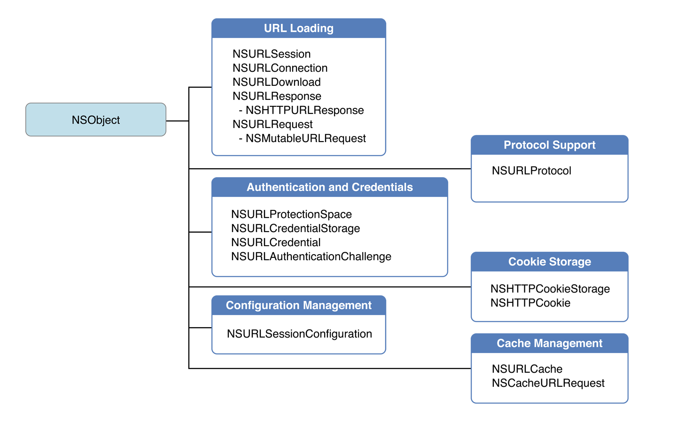
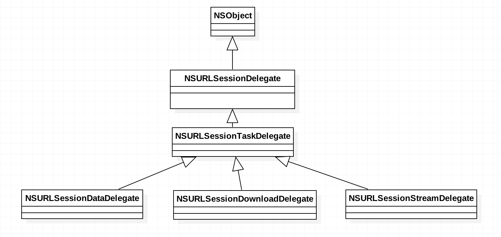
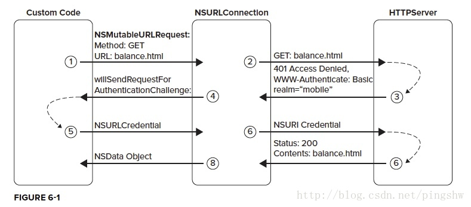

# URLSession Programming Guide
#程序员/iOS/网络编程

**为什么写这篇文章**

看AFNetworking源码看得我有点蒙，之前看SDWebImage都没这样~！说明对于iOS http网络请求还是很多不懂。so……

下图为与URLSession相关的功能类：


- - - -

# URL Loading
1. NSURLSession
2. NSURLRequest(NSMutableURLRequest)
3. NSURLResponse(NSHTTPURLResponse)

## NSURLSession
通过个这类的API来发起请求，并得到返回。在需要的时候通过相应API来配置权限认证；支持后台下载（iOS App在后台或者完全没有在运行）
查看其API可以看到它的功能分为以下几类：
1. 获取数据dataTask
2. 下载数据downloadTask
3. 上传数据uploadTask
4. 数据流streamTask(TCP/IP)
除了第四种外，别外三种都有两种方式进行数据的请求和获取：block & delegate。block就不多说了，根据参数类型直接使用就好了。
`NSURLSession `有一个delegate属性，其类型为`NSURLSessionDelegate`
在`NSURLSession`中还有很多的delegate。但都是通过这一个delegate来设置的。看一下继承关系：


在初始化NSURLSession的时候除了设置delegate还可以设置`NSURLSessionConfiguration`，单独抽出这个类进行session相关的配置（配置项太多时，抽离成一个类单独进行管理）。`NSURLSessionConfiguration`本身功能不复杂，可涉及太多配置（每一类配置对应不同的功能），放最后面好了。

## NSURLRequest(NSMutableURLRequest)
主要作用就是设置一下发送的请求
> NSURLRequest encapsulates two basic data elements of a load request: the URL to load, and the policy to use when consulting the URL content cache made available by the implementation.  
```
//1、设置请求超时等待时间（超过这个时间就算超时，请求失败）
- (void)setTimeoutInterval:(NSTimeInterval)seconds;
//2、设置请求方法（比如GET和POST）
- (void)setHTTPMethod:(NSString*)method;
//3、设置请求体
- (void)setHTTPBody:(NSData*)data;
//4、设置请求头
- (void)setValue:(NSString*)value forHTTPHeaderField:(NSString*)field;
```

## NSURLResponse(NSHTTPURLResponse)
NSURLSession返回进都会带一个NSURLResponse，它包含两部分的内容：
`metadata describing the contents and the content data itself`。它的子类`NSHTTPURLResponse `添加了其它的属性。根据文档查看并使用就好了

- - - -

# Authentication and Credentials（身份验证）
原谅链接：[网络安全传输（读书笔记） - CSDN博客](http://blog.csdn.net/pingshw/article/details/17845735)防止原文失效，这里复制一些我所关心的内容

**服务器验证过程如下：**
通过创建NSURLProtectionSpace，来确认用户访问的是安全的服务器。从一个需要验证的服务器请求资源，过程如下：


当服务器收到请求，响应发出HTTP状态码401，报头：`WWW-Authenticate，NSURLConnection`接收到后，告知APP调用`willSendRequestForAuthenticationChallenge:`；验证服务器工作就在这个函数中完成。
实现委托：
```objc
- (void)connection:(NSURLConnection *)connection willSendRequestForAuthenticationChallenge:(NSURLAuthenticationChallenge *)challenge  
```
通过验证全部或部分属性，保证APP只连接指定服务器。

1. 验证服务器全部属性
创建信任的服务器的protection space：
```objc
NSURLProtectionSpace *defaultSpace = [[NSURLProtectionSpace alloc] initWithHost:@"yourbankingdomain.com"  
                                                                           port:443  
                                                                       protocol:NSURLProtectionSpaceHTTPS  
                                                                          realm:@"mobile"  
                                                           authenticationMethod:NSURLAuthenticationMethodDefault];  
```

    然后验证`challenge.protectionSpace`是否是这个信任的服务器的protection space。

2. 验证部分指定的服务器属性

获取`challenge.protectionSpace`的各个属性，如：`challenge.protectionSpace.host，challenge.protectionSpace.port，challenge.protectionSpace.protocol`等。依次检查各个属性是否是指定值，即可。

每一个网络连接操作都是NSOperation，在后台线程执行，所以，如果这些过程中需要更新UI，需要特别注意要在主线程中完成。服务器验证很重要，但其本身不足以防范所有攻击。例如，它不能防止网络通信被偷听。

## NSURLCredentialStorage & NSURLCredentialSpace
在了解了上面所说的服务端认证后，我们再来看下NSURLCredentialStorage & NSURLCredentialSpace就很容易理解了。NSURLCredentialSpace保存了服务端的链接信息防止向错误的服务端发送了认证（相当于将用户名密码发送给别的服务器）；NSURLCredentialStorage则相当于一个字典以NSURLCredentialSpace为key，存储对应的认证信息。


## NSURLCredential
包含（1）认证的类型和认证所需要的信息；（2）认证的待久化存储设置
认证类型包含3种：用户名密码认证、客户端证书、服务端证书

eg：NSURLDownloadDelegate
```Objective-C
- (void)download:(NSURLDownload *)download didReceiveAuthenticationChallenge:(NSURLAuthenticationChallenge *)challenge
{
    // 之前已经失败过
    if ([challenge previousFailureCount] > 0) {
        
        // 为什么失败
        NSError *failure = [challenge error];
        NSLog(@"Can't authenticate:%@", [failure localizedDescription]);
        
        // 放弃
        [[challenge sender] cancelAuthenticationChallenge:challenge];
        return;
    }
    
    // 创建 NSURLCredential 对象
    NSURLCredential *newCred = [NSURLCredentialcredentialWithUser:@"sid"
                                                          password:@"MomIsCool"
                                                       persistence:NSURLCredentialPersistenceNone];
    
    // 为 challenge 的发送方提供 credential
    [[challenge sender] useCredential:newCred
           forAuthenticationChallenge:challenge];
}

```

- - - -

# NSURLProtocol
下面这位在实际项目中用过，直接参考就好了。
[iOS开发之— NSURLProtocol - 简书](http://www.jianshu.com/p/7c89b8c5482a)
（电信那边发生dns域名劫持 23333）

- - - -

# NSHTTPCookie & NSHTTPCookieStorage
呃
NSHTTPCookie对应服务端cookie对象
NSHTTPCookieStorage用于保存cookie对象

- - - -

# Cache Management
> The URL loading system provides a composite on-disk and in-memory cache allowing an app to reduce its dependence on a network connection and provide faster turnaround for previously cached responses. The cache is stored on a per-app basis. The cache is queried by NSURLSession according to the cache policy specified by the initiating NSURLRequest and NSURLSessionConfiguration objects.  
> (来自官方文档)  

## NSURLCache & NSCachedURLResponse
> An object that maps URL requests to cached response objects.  
以 `NSURLRequest`为key 保存`NSCachedURLResponse`
NSCachedURLResponse中包含了一个`response：NSCachedURLResponse`属性。

- - - -

# NSURLSessionConfiguration
> A configuration object that defines behavior and policies for a URL session.  

> Note  
> In some cases, the policies defined in this configuration may be overridden by policies specified by an NSURLRequest object provided for a task. Any policy specified on the request object is respected unless the session’s policy is more restrictive. For example, if the session configuration specifies that cellular networking should not be allowed, the NSURLRequest object cannot request cellular networking.  

`NSURLSessionConfiguration `是对session进行设置。但一个session可以有多个task。task的request可以有自己的设置。这里就涉及到优先级了。官方文档中说明的一般情况下request中配置的优先级更高，但，对于某些等级配置时，以严格的为准。

- - - -
基本的介绍就这么多，具体使用的话的可以查看[About the URL Loading System](https://developer.apple.com/library/content/documentation/Cocoa/Conceptual/URLLoadingSystem/URLLoadingSystem.html#//apple_ref/doc/uid/10000165-BCICJDHA)中的详细内容。

好了，接着看AFNetWorking去了。

