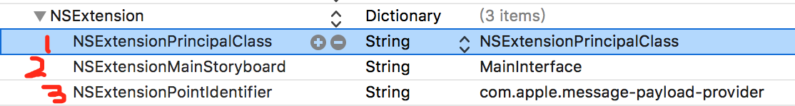
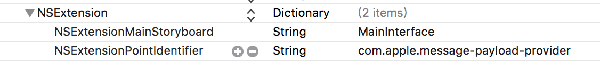
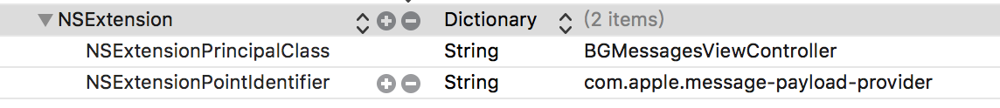
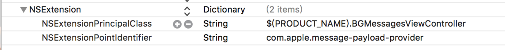

# iMessage
#程序员/iOS/扩展


#### 一. 环境

xcode：8.3.3
模拟器：iPhone 7
系统：iOS 10

#### 二. 新建项目

`xcode -> File -> new -> Target -> iMessage Extension`

#### 三. 处理警告

新创建的项目，还啥也没做就一堆警告，尴尬。一共三个

##### 1. 警告一

```
objc[55816]: Class PLBuildVersion is implemented in both /Applications/Xcode.app/Contents/Developer/Platforms/iPhoneSimulator.platform/Developer/SDKs/iPhoneSimulator.sdk/System/Library/PrivateFrameworks/PhotoLibraryServices.framework/PhotoLibraryServices (0x124fcb6f0) and /Applications/Xcode.app/Contents/Developer/Platforms/iPhoneSimulator.platform/Developer/SDKs/iPhoneSimulator.sdk/System/Library/PrivateFrameworks/AssetsLibraryServices.framework/AssetsLibraryServices (0x124b59cc0). One of the two will be used. Which one is undefined.
```

这个告警的字面意思就是说PLBuildVersion这个类在`AssetsLibraryServices.framework`和`PhotoLibraryServices.framework`中都定义了。一般好像不会有问题，但根据stackoverflow上的描述，有人崩在这里了。so，警告是无法解决了，但别人提出了一个防止崩溃的方法，如下图：


其实不用加这么多，重点是添加权限描述。

##### 2. 警告二

```
2017-08-03 18:34:47.005 iMessageExtension[55816:2564570] Failed to inherit CoreMedia permissions from 55814: (null)
```

问题原因：I have no idear

解决方法：I have no idear

##### 3. 警告三

```
2017-08-03 18:34:47.096382+0800 iMessageExtension[55816:2564531] [App] if we're in the real pre-commit handler we can't actually add any new fences due to CA restriction
2017-08-03 18:34:47.102420+0800 iMessageExtension[55816:2564531] [App] if we're in the real pre-commit handler we can't actually add any new fences due to CA restriction
```

无法解决问题的解决方法：如下图，将NSExtensionPrincipalClass添加上info.plist->NSExtension中就好了。此时NSExtension中就同时指定了NSExtensionPrincipalClass和NSExtensionMainStoryboard。对于我的环境而言，警告的确是没有了。这里有一个问题，那就是图中标识的1和2不能共存，共存之后，UI界面无法改变~！所以需要删除第2项。尴尬，iMessage感觉好鸡肋。





新建的项目，什么也没干就冒出来三个警告，还都无能为力~！WTF


#### 四. 修改配置项，使用纯代码开发

创建完extension后，默认使用sb进行UI开发，通过修改info.plist来修改，如下图。








iMessage extension中没有`appdelegate`，但有一个类似的：`MSMessagesAppViewController`。我们新建一个`BGMessagesViewController`继承这个类。

在解决警告时我提到过一个问题：添加`NSExtensionPrincipalClass`同时删除`NSExtensionMainStoryboard`时，会存在问题。

**问题描述**：如果创建Extension时，选择的语言是swfit，那么这样做会崩溃。

```
 *** Terminating app due to uncaught exception 'NSInvalidArgumentException', reason: '*** setObjectForKey: object cannot be nil (key: C97B1A7E-F753-45D5-8F54-CF7DA2D23FF5)'
*** First throw call stack:
(
	0   CoreFoundation                      0x000000010c924b0b __exceptionPreprocess + 171
	1   libobjc.A.dylib                     0x0000000108a40141 objc_exception_throw + 48
	2   CoreFoundation                      0x000000010c83f682 -[__NSDictionaryM setObject:forKey:] + 1042
	3   Foundation                          0x0000000108749d5e -[_NSExtensionContextVendor _setPrincipalObject:forUUID:] + 106
	4   Foundation                          0x00000001087492ff __105-[_NSExtensionContextVendor _beginRequestWithExtensionItems:listenerEndpoint:withContextUUID:completion:]_block_invoke + 804
	5   libdispatch.dylib                   0x000000010d910585 _dispatch_call_block_and_release + 12
	6   libdispatch.dylib                   0x000000010d931792 _dispatch_client_callout + 8
	7   libdispatch.dylib                   0x000000010d917237 _dispatch_queue_serial_drain + 1022
	8   libdispatch.dylib                   0x000000010d91798f _dispatch_queue_invoke + 1053
	9   libdispatch.dylib                   0x000000010d917d31 _dispatch_queue_override_invoke + 374
	10  libdispatch.dylib                   0x000000010d919899 _dispatch_root_queue_drain + 813
	11  libdispatch.dylib                   0x000000010d91950d _dispatch_worker_thread3 + 113
	12  libsystem_pthread.dylib             0x000000010dcc55a2 _pthread_wqthread + 1299
	13  libsystem_pthread.dylib             0x000000010dcc507d start_wqthread + 13
)
libc++abi.dylib: terminating with uncaught exception of type NSException
```

**问题分析：**主要原因是因为swfit新的特性：module。可以看下面的例子：

swift项目

```
(lldb) po self
<iMessageDemo.ViewController: 0x7f89d0508ad0>
```

oc项目

```
(lldb) po self
<ViewController: 0x7fdf86e04330>

```

可以看到，对于swift项目，在查找一个类的时候需要知道类所在的module。所以上面的crash是因为找到不对应的类文件。

解决方案：根据上述分析，在设置类的时候，我们把module加上就好了。如下图





#### 五. MSMessagesAppViewController中处理会话回调的方法

##### willBecomeActive

Called when the extension is about to move from the inactive to active state.
This will happen when the extension is about to present UI.
当需要展示UI的时候就会被调用
Use this method to configure the extension and restore previously stored state.


##### didResignActive

Called when the extension is about to move from the active to inactive state.
This will happen when the user dissmises the extension, changes to a different
conversation or quits Messages.
翻译：这函数会在extension消失、切换会话或者退出消息的时候被调用。
说人话：
extension消失: (1)手指向下滑动时，imessage功能条回到屏幕最下方时，extension消失；

​			(2)在extension状态，点击输入框时，切换到输入状态，extension消失；

切换会话或者退出消息：顶部导航返回，退出短信

Use this method to release shared resources, save user data, invalidate timers,
and store enough state information to restore your extension to its current state
in case it is terminated later.sys

> 我在模拟器上，在extension状态直接Home时，crash~! 但之前真机上是没有问题的~！鸡肋  


##### didReceive

Called when a message arrives that was generated by another instance of this
extension on a remote device.

收到相同的extension发来的消息。这里说“a remote device”，我们知道，iMessage是可以自己给自己发消息的。当自己给自己发送消息的时候，短信界面有两个会话，一个是自己收，另一个是自己发。那么问题来了，这算“a remote device”么~！😂

搞笑了，这个方法可以在收到同类extension发来的消息时被调用，即使此时这个extension不在活跃状态。

Use this method to trigger UI updates in response to the message.


#####  didStartSending

Called when the user taps the send button.


##### didCancelSending

Called when the user deletes the message without sending it.

Use this to clean up state related to the deleted message.

##### willTransition

Called before the extension transitions to a new presentation style.

Use this method to prepare for the change in presentation style.

#####  didTransition

Called after the extension transitions to a new presentation style.

Use this method to finalize any behaviors associated with the change in presentation style.

最后这两上放一起说好了。iMessage的界面有两种状态，一种是收缩，另一种是展开。收缩状态的大小大概和输入法键盘的大小差不多（这里的大小有问题）。展开状态就是全屏了。从开发过程和使用过程，我发现收缩状态时大小存在一定的问题：即收缩状态的大小并不统一。所以，有时会看到extension的应用选择界面存在重叠的情况~！尴尬

#### 六. Sticker
一般直接使用MSStickerBrowserViewController来展示sticker。这个VC就是一个被封装好了的CollectionViewController，并且每个Cell支持Gif。MSStickerBrowserViewController只对外暴露了dataSourceDelegate。下面给出一个简单的例子。
```swift
import UIKit
import Messages

class BGStickerBrowserViewController: MSStickerBrowserViewController {

    var dataSource : Array<MSSticker> = []
    
    
    override func viewDidLoad() {
        super.viewDidLoad()
        title = "Sticker"
        navigationController?.navigationBar.isHidden = false
        view.backgroundColor = UIColor.white
        let stickerUrls = Bundle.main.urls(forResourcesWithExtension: ".gif", subdirectory: "")
        guard stickerUrls != nil ,(stickerUrls?.count)!>0 else {
            return
        }
        for ele in stickerUrls! {
            let sticker = try? MSSticker(contentsOfFileURL: ele, localizedDescription: ele.path)
            guard sticker != nil else {
                continue
            }
            dataSource.append(sticker!)
        }
    }
    
    override func numberOfStickers(in stickerBrowserView: MSStickerBrowserView) -> Int {
        return dataSource.count
    }
    
    override func stickerBrowserView(_ stickerBrowserView: MSStickerBrowserView, stickerAt index: Int) -> MSSticker {
        return dataSource[index]
    }
}

```
#### 七.  发送消息
在MSStickerBrowserViewController中点击sticker就可以发送贴纸消息，然后MSStickerBrowserViewController并没有暴露出相应的delegate，所以对于点击事件后的消息生成我们无能为力。
在iMessage中使用MSConversation来完全掌控消息的构建与插入。（注意这里是插入，apple多次强调的一点：消息最终的发送权在用户手里。extension无权也无法发送消息。）下面弄一个简单的例子来示范一下消息的构建与插入。代码不是很多，重点在第一个函数。
```swift
import UIKit
import Messages

class BGSelfDefineViewController: UIViewController {

    //创建消息并插入
    func handleSendButtonClick(sender:UIButton) {
        //BGConversationManager.shared.appDeleagte这个就是MSMessagesAppViewController的实例。
        if let image = createImageForMessage(), let conversation = BGConversationManager.shared.appDeleagte?.activeConversation {
            //layout还有很多别的属性值可以设置，详细请查看文档
            let layout = MSMessageTemplateLayout()
            layout.image = image
            layout.caption = "Stepper Value"
            
            let message = MSMessage()
            message.layout = layout
            message.url = URL(string: "emptyURL")
            
            //收起页面，以展示插入的消息
            BGConversationManager.shared.appDeleagte?.requestPresentationStyle(.compact)
            conversation.insert(message, completionHandler: { (error) in
                print(error ?? "")
            })
            
//    其它的消息类型
//    conversation.insert(<#T##message: MSMessage##MSMessage#>, completionHandler: <#T##((Error?) -> Void)?##((Error?) -> Void)?##(Error?) -> Void#>)   //发送自定义消息
//    conversation.insertText(<#T##text: String##String#>, completionHandler: <#T##((Error?) -> Void)?##((Error?) -> Void)?##(Error?) -> Void#>)     //发送文本消息
//    conversation.insert(<#T##sticker: MSSticker##MSSticker#>, completionHandler: <#T##((Error?) -> Void)?##((Error?) -> Void)?##(Error?) -> Void#>)   //发送sticker消息
//    发送url: 图片，音频，视频的链接，详细使用请查看文档
//   conversation.insertAttachment(<#T##URL: URL##URL#>, withAlternateFilename: <#T##String?#>, completionHandler: <#T##((Error?) -> Void)?##((Error?) -> Void)?##(Error?) -> Void#>)
        }
    }


    //将view转换成图片插入，这不是重点。
    func createImageForMessage() -> UIImage? {
        let background = UIView(frame: CGRect(x: 0, y: 0, width: 300, height: 300))
        background.backgroundColor = UIColor.white
        
        let label = UILabel(frame: CGRect(x: 75, y: 75, width: 150, height: 150))
        label.font = UIFont.systemFont(ofSize: 56.0)
        label.backgroundColor = UIColor.red
        label.textColor = UIColor.white
        label.text = "1"
        label.textAlignment = .center
        label.layer.cornerRadius = label.frame.size.width/2.0
        label.clipsToBounds = true
        
        background.addSubview(label)
        background.frame.origin = CGPoint(x: view.frame.size.width, y: view.frame.size.height)
        view.addSubview(background)
        
        UIGraphicsBeginImageContextWithOptions(background.frame.size, false, UIScreen.main.scale)
        background.drawHierarchy(in: background.bounds, afterScreenUpdates: true)
        let image = UIGraphicsGetImageFromCurrentImageContext()
        UIGraphicsEndImageContext()
        
        background.removeFromSuperview()
        
        return image
    }
    
    override func viewDidLoad() {
        super.viewDidLoad()
        view.backgroundColor = UIColor.white
        title = "Self Define"
        navigationController?.navigationBar.isHidden = false
        
        view.addSubview(sendButton)
        sendButton.widthAnchor.constraint(equalToConstant: 140).isActive = true
        sendButton.heightAnchor.constraint(equalToConstant: 40).isActive = true
        sendButton.centerXAnchor.constraint(equalTo: self.view.centerXAnchor).isActive = true
        sendButton.centerYAnchor.constraint(equalTo: self.view.centerYAnchor, constant: -25).isActive = true
    }
    
    //在界面止添加一个按键，用来触发消息的生成与插入
    lazy var sendButton : UIButton = {
        let view : UIButton = UIButton()
        view.backgroundColor = UIColor.white
        view.layer.borderColor = UIColor.gray.cgColor
        view.layer.borderWidth = 0.5
        view.setTitle("Send", for: .normal)
        view.setTitleColor(UIColor.black, for: .normal)
        view.addTarget(self, action: #selector(handleSendButtonClick(sender:)), for: .touchUpInside)
        view.translatesAutoresizingMaskIntoConstraints = false
        return view
        
    }()
    
}

```

#### 八. 接收消息
在<五>中我们已经提到过`didReceive`用于接收消息。message中的许多内容是在发送的时候设置的。相关属性查看文档就好了。
```swift
    override func didReceive(_ message: MSMessage, conversation: MSConversation) {
        // Called when a message arrives that was generated by another instance of this
        // extension on a remote device.
        
        // Use this method to trigger UI updates in response to the message.
    }

```
这时只强调一处(以下内容来自官方文档)
A URL that encodes data to be transmitted with the message.
Encode your application’s data in the URL. For example, you can encode data as key-value pairs in the URL’s query string, as shown below:
```swift
guard let components = NSURLComponents(string: myBaseURL) else {
    fatalError("Invalid base url")
}
 
let size = NSURLQueryItem(name: "Size", value: "Large")
let count = NSURLQueryItem(name: "Topping_Count", value: "2")
let cheese = NSURLQueryItem(name: "Topping_0", value: "Cheese")
let pepperoni = NSURLQueryItem(name: "Topping_1", value: "Pepperoni")
components.queryItems = [size, count, cheese, pepperoni]
 
guard let url = components.url  else {
    fatalError("Invalid URL components.")
}
 
message.url = url
```
The message object is delivered to the extension running on the recipient’s device. The extension can access the session’s current state from the message’s URL property, as shown below:
```swift
guard let components = NSURLComponents(url: message.url, resolvingAgainstBaseURL: false) else {
    fatalError("The message contains an invalid URL")
}
 
if let queryItems = components.queryItems {
    // process the query items here...
}
```
If the message is selected on macOS, the system loads the URL in a web browser. The URL should point to a web service that returns a meaningful result based on the encoded data.
The URL property must use an HTTP, HTTPS, or data scheme. Custom app schemes are not supported. Additionally, the URL cannot be longer than 5,000 characters.
By default, this property is set to nil.

需要注意的是黑色加粗的内容。

#### 九. 点击消息
点击消息的时候`MSMessagesAppViewController.activeConversation中的selectedMessage`就是被点击的消息，而消息中的内容就是MSMessage对象。
那么如何截获点击消息这个事件呢？
消息可以被点击的前提是MSMessagesAppPresentationStyle处于收缩状态，而消息被点击后会进入展开状态。所以，点击消息的截获就在这里了。
```swift
    override func willTransition(to presentationStyle: MSMessagesAppPresentationStyle) {
        super.willTransition(to: presentationStyle)
        
        // Hide child view controllers during the transition.
        removeAllChildViewControllers()
    }
    
    override func didTransition(to presentationStyle: MSMessagesAppPresentationStyle) {
        super.didTransition(to: presentationStyle)
        
        // Present the view controller appropriate for the conversation and presentation style.
        guard let conversation = activeConversation else { fatalError("Expected an active converstation") }
        presentViewController(for: conversation, with: presentationStyle)
    }

```

#### 十. imessage与主app之间的数据通信
这个文章感觉写得不错http://blog.csdn.net/shengpeng3344/article/details/52190997 我就不多说了。

#### 十一. 注意事项
1. iMessage需要在compact和expended之间来回切换，所以介意不要使用frame来构建布局，使用自动布局可以省好很多工夫。
2. compact的高度在同一设备上可能会变化，有时候系统页面也会出现重叠现象。
3. 忘记了
