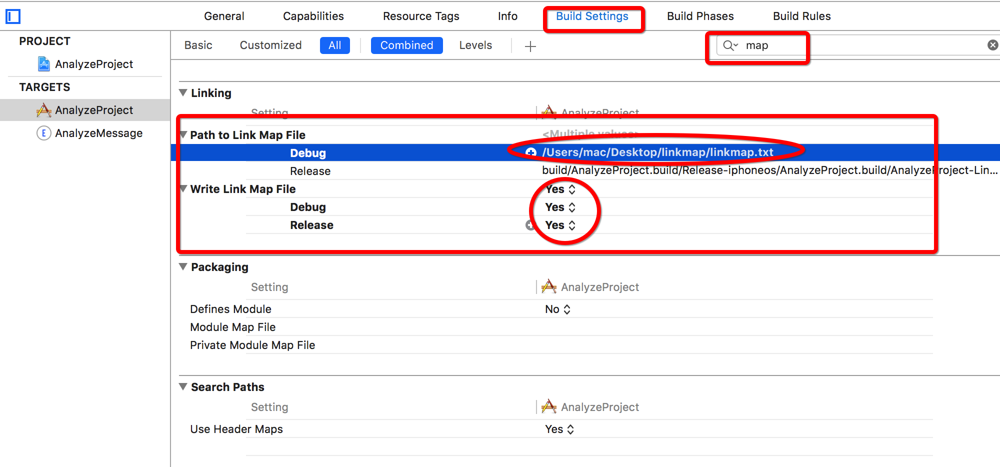

# linkmap
#程序员/iOS/项目设置

### 得到LinkMap文件

_设置路径的时候注意不是文件夹而是文件，文件类型个人建议写".m"（虽然是个txt，但.m使用IDE查看的时候要好很多）_

### 文件功能

LinkMap是对最终的Mach-O文件的一个描述
```sh
➜  ~ file /Users/mac/Desktop/linkmap/AnalyzeProject.app/AnalyzeProject 
/Users/mac/Desktop/linkmap/AnalyzeProject.app/AnalyzeProject: Mach-O 64-bit executable x86_64
```

用途：计算代码段大小
[关于iOS包大小需要注意的两点 - 简书](http://www.jianshu.com/p/84d951d67d0f)

### 文件结构
#### Path
Math-O文件路径

#### Arch
CPU架构

#### Object files
目标文件列表：`.o`、静态链接库文件
```
# Object files:
[  0] linker synthesized
[  1] /Users/mac/Library/Developer/Xcode/DerivedData/AnalyzeProject-eykhluidsbdclzbmcbhspgxgslui/Build/Intermediates.noindex/AnalyzeProject.build/Debug-iphonesimulator/AnalyzeProject.build/AnalyzeProject.app.xcent
[  2] /Users/mac/Library/Developer/Xcode/DerivedData/AnalyzeProject-eykhluidsbdclzbmcbhspgxgslui/Build/Intermediates.noindex/AnalyzeProject.build/Debug-iphonesimulator/AnalyzeProject.build/Objects-normal/x86_64/ViewController.o
[  3] /Users/mac/Library/Developer/Xcode/DerivedData/AnalyzeProject-eykhluidsbdclzbmcbhspgxgslui/Build/Intermediates.noindex/AnalyzeProject.build/Debug-iphonesimulator/AnalyzeProject.build/Objects-normal/x86_64/main.o
[  4] /Users/mac/Library/Developer/Xcode/DerivedData/AnalyzeProject-eykhluidsbdclzbmcbhspgxgslui/Build/Intermediates.noindex/AnalyzeProject.build/Debug-iphonesimulator/AnalyzeProject.build/Objects-normal/x86_64/AppDelegate.o
[  5] /Applications/Xcode.app/Contents/Developer/Platforms/iPhoneSimulator.platform/Developer/SDKs/iPhoneSimulator11.1.sdk/System/Library/Frameworks//Foundation.framework/Foundation.tbd
[  6] /Applications/Xcode.app/Contents/Developer/Platforms/iPhoneSimulator.platform/Developer/SDKs/iPhoneSimulator11.1.sdk/usr/lib/libobjc.tbd
[  7] /Applications/Xcode.app/Contents/Developer/Platforms/iPhoneSimulator.platform/Developer/SDKs/iPhoneSimulator11.1.sdk/System/Library/Frameworks//UIKit.framework/UIKit.tbd

```

#### Sections
段表，描述各个段在最后编译成的可执行文件中的偏移位置及大小，包括了代码段（TEXT，保存程序代码段编译后的机器码）和数据段（DATA，保存变量值）。
首列是数据在文件的偏移位置，第二列是这一段占用大小，第三列是段类型、代码段和数据段，第四列是段名称。
这里可以清楚看到各种类型的数据在最终可执行文件里占的比例：例如 text 表示编译后的程序执行语句，data 表示已经初始化的全局变量和局部静态变量，__cstring 表示代码里的字符串常量，等等。
```
# Sections:
# Address	Size    	Segment	Section
0x1000016E0	0x00000343	__TEXT	__text
0x100001A24	0x0000003C	__TEXT	__stubs
0x100001A60	0x00000074	__TEXT	__stub_helper
0x100001AD4	0x00000A35	__TEXT	__objc_methname
0x100002509	0x0000003C	__TEXT	__objc_classname
0x100002545	0x0000086D	__TEXT	__objc_methtype
0x100002DB2	0x0000007A	__TEXT	__cstring
0x100002E2C	0x0000018A	__TEXT	__entitlements
0x100002FB8	0x00000048	__TEXT	__unwind_info
0x100003000	0x00000010	__DATA	__nl_symbol_ptr
0x100003010	0x00000050	__DATA	__la_symbol_ptr
0x100003060	0x00000010	__DATA	__objc_classlist
0x100003070	0x00000010	__DATA	__objc_protolist
0x100003080	0x00000008	__DATA	__objc_imageinfo
0x100003088	0x00000BE8	__DATA	__objc_const
0x100003C70	0x00000018	__DATA	__objc_selrefs
0x100003C88	0x00000010	__DATA	__objc_classrefs
0x100003C98	0x00000008	__DATA	__objc_superrefs
0x100003CA0	0x00000008	__DATA	__objc_ivar
0x100003CA8	0x000000A0	__DATA	__objc_data
0x100003D48	0x000000C0	__DATA	__data
```

#### Symbols
列出每个文件的每个Symbols的位置和占用空间。同样首列是数据在执行文件中的偏移地址，第二列是占用大小，第三列是所属文件序号，对应上述 Object files 列表，最后是名字。
例如：2号文件（`ViewController.o`）中`[ViewController didReceiveMemoryWarning]`方法占用的空间大小：60byte。
```
0x1000016E0	0x0000003C	[  2] -[ViewController didReceiveMemoryWarning]
```

```Objective-C
- (void)didReceiveMemoryWarning {
    [super didReceiveMemoryWarning];
    // Dispose of any resources that can be recreated.
}
```
是的，这样一个基本上算是空的方法也占用了空间~！将这个方法干掉后再查看LinkMap文件，相应内容就没了。所以，你懂的~

```
# Address	Size    	File  Name
0x1000016E0	0x0000005E	[  2] -[ViewController viewDidLoad]
0x100001740	0x00000090	[  3] _main
0x1000017D0	0x00000080	[  4] -[AppDelegate application:didFinishLaunchingWithOptions:]
0x100001850	0x00000040	[  4] -[AppDelegate applicationWillResignActive:]
0x100001890	0x00000040	[  4] -[AppDelegate applicationDidEnterBackground:]
0x1000018D0	0x00000040	[  4] -[AppDelegate applicationWillEnterForeground:]
0x100001910	0x00000040	[  4] -[AppDelegate applicationDidBecomeActive:]
0x100001950	0x00000040	[  4] -[AppDelegate applicationWillTerminate:]
0x100001990	0x00000020	[  4] -[AppDelegate window]
0x1000019B0	0x00000040	[  4] -[AppDelegate setWindow:]

```


### 用法
根据上面的介绍，我们可以把所有 file 相同的 size 加起来，就可以得到该文件的大小了，根据文件的前缀名，就可以得到项目中各个独立模块的大小了。还可以对两个迭代得到的 linkmap 文件分析结果进行比较就可以得出，这个迭代相比上个迭代新增了多少文件，减少了多少文件，哪些文件比较大需要减少等信息。


[Mach-O Introduction](https://developer.apple.com/library/content/documentation/DeveloperTools/Conceptual/MachOTopics/0-Introduction/introduction.html)