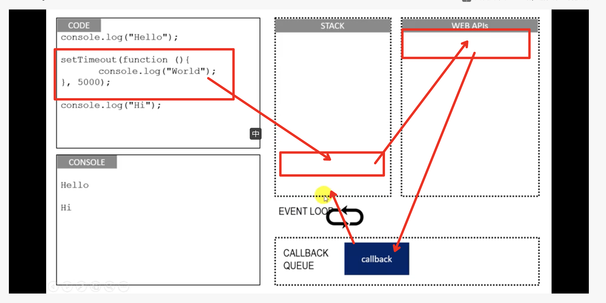
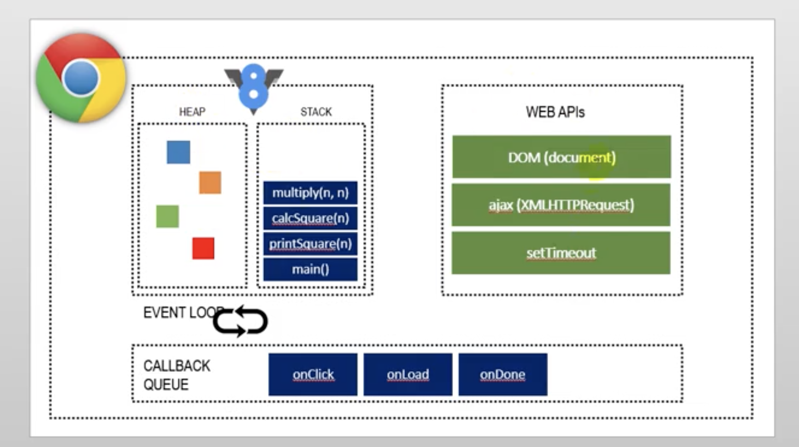

# NodeJS

## pm2

[QuickStartDoc](https://pm2.keymetrics.io/docs/usage/quick-start/)

`npm install pm2 -g`


## 异步

两张比较形象的图






### 流程控制

1. 事件发布/订阅模式

    1. [Node自身提供的events 模块](http://nodejs.org/docs/latest/api/events.html )

    2. 继承EventEmitter

        ```js
        var EventEmitter = require('events').EventEmitter;
        util.inherits(Master, EventEmitter);
        ```

2. 事件队列

    ```js
    var events = require('events');
    var proxy = new events.EventEmitter();
    
    function dbselect(index, callback) {
        setTimeout(function () {
            console.log("in db:" + index);
            callback(index);
        },1000);
    }
    
    var status = "ready";
    var select = function (index,callback) {
        proxy.once("selected", callback);//将所有调用压入队列
        if (status === "ready") {
            status = "pending";
            dbselect(index, function (results) {
                proxy.emit("selected", results);
                status = "ready";
                callback(results);
            });
        }
        else {
            console.log("pending"+ index);
        }
    };
    
    for (let i = 0 ; i < 5; i++) {
        select(i,function (index) {
            console.log(index);//全是0，因为只有第一个被执行了，其它的都是复用数据
        });
    }
    
    ```

3. 多对一

    ```js
    function render(results) {
        console.log(results)
    }
    
    var after = function (times, callback) {
      var count = 0, results = {};
      return function (key, value) {
        results[key] = value;
        count++;
        if (count === times) {
          callback(results);
        }
      };
    };
    var done = after(3, render);
    setTimeout(()=>done('key1','result1'),3000);
    setTimeout(()=>done('key2','result3'),4000);
    setTimeout(()=>done('key3','result3'),5000);
    ```

    ```
    var events = require('events');
    var emitter = new events.EventEmitter();
    
    function render(results) {
        console.log(results)
    }
    
    var count = 0, results = {};
    emitter.on('someEvent', function (key, value) {
        results[key] = value;
        count++;
        if (count === 3) {
            render(results);
        }
    });
    
    setTimeout(function () {
        emitter.emit('someEvent', 'arg11 参数', 'arg21 参数');
    }, 3000);
    
    
    setTimeout(function () {
        emitter.emit('someEvent', 'arg12 参数', 'arg22 参数');
    }, 4000);
    
    
    setTimeout(function () {
        emitter.emit('someEvent', 'arg13 参数', 'arg23 参数');
    }, 5000);
    
    
    
    ```

    ```js
    var EventProxy = require('EventProxy');
    
    var proxy = new EventProxy()
    var result = {};
    proxy.all('done1','done2','done3',function (result1,result2,result3) {
        console.log(`${result1} + ${result2} + ${result3}`);
    });
    
    
    setTimeout(function () {
        proxy.emit('done1','key1');
    },2000);
    
    setTimeout(function () {
        proxy.emit('done2','key2');
    },3000);
    
    setTimeout(function () {
        proxy.emit('done3','key3');
    },4000);
    ```

    4. Promise/Deferred
    5. async
    6. step
    7. wind:$await()


### 异常并发控制

1. 对异步API添加过载保护
    1. bagpipe
    2. async.parallelLimit

### 总结 

整个异步处理的方式和原生的模式差不多，只是原生有系统API支持。但在JS上，似乎是一些第三方库。

关于异步，还需要后面再单独学习一下。


## 内存控制

> 只是做为Node服务器需要关注

### 垃圾回收基础

1. V8
    1. 无法使用大内存
        1. V8底层做了限制，导致Node服务无法使用全部内存
    2. 堆内存总量是被限制的
        1. 浏览器不太会有大量堆内存的场景
        2. 垃圾回收需要占用主线程，影响性能
        3. 当然 ，这个是可以改的。
    3. 垃圾回收机制
        1. 没有一种统一的全面的回收算法
        2. 统计学
        3. 回收算法
            1. 分代：新生代、老生代
            2. 新生代
                1. Scavenge
                    1. Cheney
                2. 晋升
            3. 老生代
                1. Mark-sweep：标记死亡对象，进行回收
                2. Mark-compact：标记需要移动的对象。解决内存碎片
            4. 回收的时候需要停顿所有应用逻辑
                1. Incremental Marking
                    1. 一小步一小步的来，为了保障性能
            5. 还有很多别的算法

	### 内存使用优化

垃圾回收算法已经在那里了，我们写代码的时候需要注意一下，可以提高垃圾回收的效率

1. 作用域
2. 闭包

### 内存泄露

1. 原因
    1. 缓存
    2. 队列消费不及时
    3. 作用域未释放
2. 可以使用工具排查内存泄露


